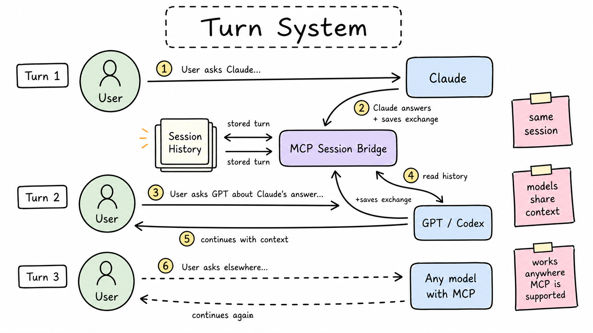

# MCP Session Bridge

MCP Session Bridge is a small remote MCP server for shared, multi-model conversation memory. It gives different LLM assistants one durable place to create sessions, save full user/model exchanges, read transcripts in bounded chunks, and upload session/group text files.

It is intentionally narrow. The bridge stores conversation history; it does not upload or manage the user's external project files. Users can still paste files or attach notes directly in their chat client, while MCP Session Bridge keeps the cross-model transcript consistent.

## What It Does

- Runs a remote MCP server over streamable HTTP with FastMCP and Uvicorn.
- Supports OAuth authorization-code + PKCE and dynamic client registration.
- Stores sessions, transcript exchanges, OAuth records, and admin events in SQLite.
- Returns long transcripts in chunks so clients do not need one oversized tool result.
- Saves uploaded session and group text files for reusable context.
- Includes an offline transcript viewer and an authenticated admin correction UI.
- Ships a local demo script for understanding the core workflow without setting up a remote MCP client.



## Quickstart

Requirements:

- Python 3.12+
- [uv](https://docs.astral.sh/uv/)

```bash
git clone https://github.com/NivailoPL/mcp-session-bridge.git
cd mcp-session-bridge
cp .env.example .env
uv sync
uv run python scripts/demo_session.py
```

Expected output:

```text
Created session: demo-...
Saved exchange #1: USER -> Claude
Saved exchange #2: USER -> GPT
Overview: 2 exchanges, 4 turns, 1 transcript chunk
Transcript written to: examples/output/demo-transcript.md
OK
```

The generated demo files are written to `examples/output/`, which is ignored by git. Static examples live in `examples/`.

## Run Locally

Generate local owner credentials:

```bash
uv run python scripts/set_owner_password.py --username owner
```

Start the server:

```bash
uv run uvicorn app.main:app --host 127.0.0.1 --port 8787 --reload
```

Check that the HTTP app is alive:

```bash
curl http://127.0.0.1:8787/healthz
```

The MCP endpoint defaults to:

```text
http://127.0.0.1:8787/mcp
```

## MCP Tools

| Tool | Purpose |
| --- | --- |
| `bridge_ping` | Minimal authenticated MCP health check. |
| `auth_whoami` | Shows the OAuth client attached to the current token. |
| `save_probe` / `read_probe` | Simple connector testing tools for non-sensitive strings. |
| `list_session_groups` | Lists local session groups and their valid `group_id` values. |
| `create_session` | Creates a new conversation session. |
| `list_sessions` | Lists saved sessions. |
| `get_session_overview` | Returns session metadata and transcript chunk information. |
| `get_last_speaker` | Reports who saved the last turn so a continuing model can skip re-fetching chunks. |
| `get_session_transcript_chunk` | Returns one bounded transcript chunk. |
| `save_exchange` | Saves one full user/model exchange. |
| `upload_session_file` | Saves a text file for one session. |
| `upload_group_file` | Saves a text file for an entire session group. |
| `list_session_files` | Lists uploaded session/group files. |
| `download_session_file` | Reads one uploaded text file by `file_id`. |

Typical model flow:

1. Establish the right `session_id` with `create_session` or `list_sessions`.
   For a new session, call `list_session_groups` first and pass a valid `group_id` when the user names a group. Omit `group_id` to use `uncategorized`.
2. Call `get_session_overview`, then `get_last_speaker` with your own `model_name`.
3. If `get_last_speaker` reports that you saved the last turn and you are still in the same chat window, you may skip the chunk fetch; otherwise fetch every `get_session_transcript_chunk` from `1` through `transcript_chunk_count`.
4. Prepare the response.
5. Call `save_exchange` before showing the response to the user.
6. If the user asks to save a summary, plan, note, or reusable context, use `upload_session_file` or `upload_group_file`.

Session groups and uploaded files are runtime data in the SQLite database. User-created groups and their files are not stored in tracked repo configuration. The admin panel at `/admin/sessions` can create, edit, delete, filter by, and move sessions between groups.

`get_session_overview` returns `response_display_timezone` for the configured bridge display timezone. `save_exchange` returns `assistant_created_at_display` and `assistant_created_at_timezone`; use that returned display timestamp as the user-visible response timestamp. The bridge renders response display timestamps in the configured bridge display timezone, UTC by default, so clients should not convert that value into their own local timezone.

## Documentation

- [Installation](docs/installation.md)
- [Client setup](docs/client-setup.md)
- [Model instructions](docs/model-instructions.md)
- [Deployment](docs/deployment.md)
- [Security](docs/security.md)
- [Limitations](docs/limitations.md)
- [Operations](docs/operations.md)

Docker is intentionally out of scope for v0.1.

## Development

Run tests:

```bash
uv run pytest
```

GitHub Actions also runs the test suite and demo script on pushes and pull requests.

If the virtual environment was moved between machines or looks inconsistent, rebuild it:

```bash
rm -rf .venv
uv sync
uv run pytest
```

Inspect saved local sessions:

```bash
uv run python scripts/session_audit.py list
uv run python scripts/session_audit.py show <session_id>
```

Export data for the offline viewer:

```bash
uv run python scripts/session_audit.py export-viewer --output session-viewer-data.json
python3 -m http.server 8799 --bind 127.0.0.1
```

Then open `http://127.0.0.1:8799/session-viewer.html`.

## Project Hygiene

- [Contributing](CONTRIBUTING.md)
- [Security policy](SECURITY.md)
- [Changelog](CHANGELOG.md)
- [License](LICENSE)

## Important Files

| Path | Role |
| --- | --- |
| `app/main.py` | FastMCP server, routes, and tool definitions. |
| `app/oauth.py` | OAuth dynamic registration, login, token exchange, and refresh. |
| `app/storage.py` | SQLite schema and persistence for sessions, transcripts, and tokens. |
| `app/session_package.py` | Transcript rendering and chunking. |
| `app/admin.py` | Admin login and transcript correction API. |
| `scripts/demo_session.py` | Local demo transcript generator. |
| `scripts/session_audit.py` | CLI for session inspection and viewer export. |
| `docs/project-prompt-template.md` | Copyable project prompt for model clients. |
| `session-viewer.html` | Offline transcript viewer. |
| `admin-viewer.html` | Admin correction UI served by the backend. |

## License

MIT. See [LICENSE](LICENSE).
