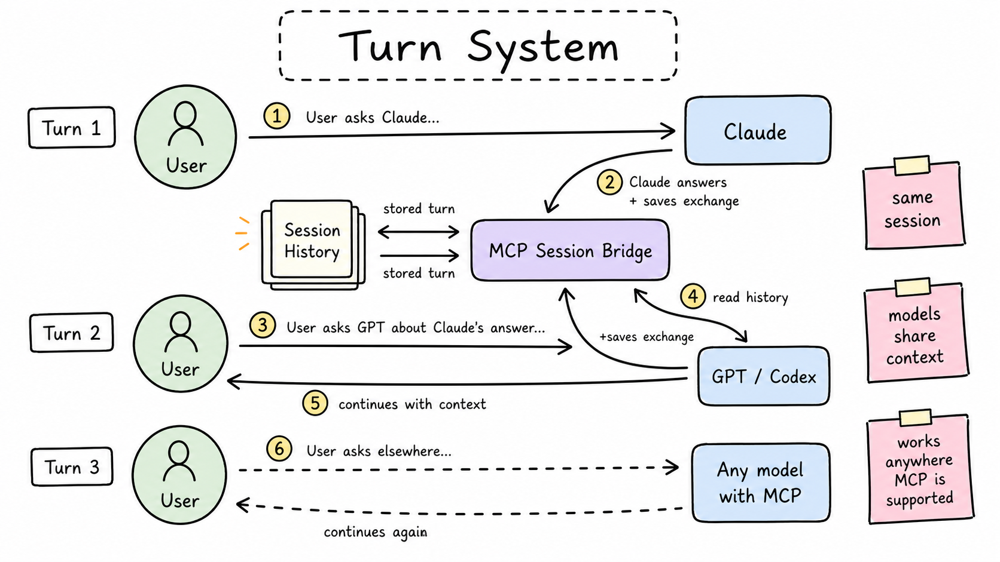

# MCP Session Bridge

MCP Session Bridge is a small remote MCP server for shared, multi-model conversation memory. It gives different LLM assistants one durable place to create sessions, save full user/model exchanges, read transcripts in bounded chunks, and keep session/group text files and PDFs.

It is intentionally narrow. Files enter the bridge only through an explicit upload in the admin UI or the file/PDF MCP tools. The bridge does not watch, scan, or automatically ingest the user's external project files or directories.

## What It Does

- Runs a remote MCP server over streamable HTTP with FastMCP and Uvicorn.
- Supports OAuth authorization-code + PKCE and dynamic client registration.
- Stores sessions, transcript exchanges, OAuth records, and admin events in SQLite.
- Returns long transcripts in chunks so clients do not need one oversized tool result.
- Saves explicitly uploaded session and group text files or PDFs for reusable context.
- Includes an offline transcript viewer and an authenticated admin UI for transcript correction, file management, and full-database search.
- Provides local BM25 search plus optional OpenAI embeddings and Cohere reranking for admin-only Hybrid search.
- Ships a local demo script for understanding the core workflow without setting up a remote MCP client.



## Quickstart

For a persistent VPS installation, prepare a Debian or Ubuntu server with SSH, a public IP, a hostname you control, and inbound ports 22, 80, and 443. Then run:

```bash
apt-get update
apt-get install -y git curl ca-certificates
git clone https://github.com/NivailoPL/mcp-session-bridge.git
cd mcp-session-bridge
./mcp-bridge setup
```

The resumable CLI installs the global `mcp-bridge` command as soon as setup starts. In a normal SSH terminal, use Up/Down, Enter, Escape, and `q` to browse status-aware submenus; `TERM=dumb` retains a numbered fallback. Browsing and Return do not change the server. Prepared service changes remain inactive until you explicitly choose **Activate Managed Installation**. Activation takes a final SQLite backup, switches systemd/Caddy, verifies the service, and restores the previous service configuration if verification fails.

Setup distinguishes `DETECTED`, `NEEDS INPUT`, `READY`, `ACTIVE`, `WAITING`, and `FAILED`, always showing what exists and what should happen next. Headings use the Indygo terminal accent when color is supported; set `NO_COLOR=1` or pass global `--no-color` for plain output.

Verify the server:

```bash
mcp-bridge status
mcp-bridge doctor
```

Portable database and lifecycle commands are also available without the menu:

```bash
mcp-bridge database inspect --json
mcp-bridge database verify
mcp-bridge database backup --output /safe/path/bridge.sqlite3
mcp-bridge database import /safe/path/bridge.sqlite3 --replace
mcp-bridge service inspect
mcp-bridge installation uninstall --dry-run --remove-data --output /safe/path/bridge.sqlite3
```

Database import replaces the complete current database; it does not merge records. Bridge creates and verifies a final safety backup after stopping the service, swaps the prepared SQLite file atomically, checks WAL write access as the service user, and restores the previous database on failure. The portable database is sensitive: it contains conversations, uploaded files, OAuth/application rows, and settings. When restoring it into an installation with a new `BRIDGE_SECRET_KEY`, reconnect harnesses and re-enter encrypted provider keys.

Read the complete [managed server installation guide](docs/managed-installation.md), including adoption, updates, rollback, and the future Agent Plugins boundary. Client/harness connection is intentionally a separate step.

## Run Locally

Generate local owner credentials:

```bash
uv run python scripts/set_owner_password.py --username owner
```

Start the server:

```bash
uv run uvicorn app.main:app --host 127.0.0.1 --port 8787 --reload
```

Check that the HTTP app is alive:

```bash
curl http://127.0.0.1:8787/healthz
```

The MCP endpoint defaults to:

```text
http://127.0.0.1:8787/mcp
```

## MCP Tools

| Tool | Purpose |
| --- | --- |
| `bridge_ping` | Minimal authenticated MCP health check. |
| `auth_whoami` | Shows the OAuth client attached to the current token. |
| `save_probe` / `read_probe` | Simple connector testing tools for non-sensitive strings. |
| `run_output_probe` | Returns a large checkpointed payload for measuring one MCP tool result through a named harness. |
| `submit_output_probe_observation` | Validates the canaries visible to the model and records the harness result. |
| `list_session_groups` | Lists local session groups and their valid `group_id` values. |
| `create_session` | Creates a new conversation session. |
| `get_session_overview` | Returns session metadata and transcript chunk information. |
| `get_last_speaker` | Reports who saved the last turn so a continuing model can skip re-fetching chunks. |
| `get_session_transcript_chunk` | Returns one bounded transcript chunk. |
| `save_exchange` | Saves one full user/model exchange. |
| `upload_session_file` | Saves a text file for one session. |
| `upload_group_file` | Saves a text file for an entire session group. |
| `upload_session_pdf` | Saves an original PDF for one session and extracts its text without OCR. |
| `upload_group_pdf` | Saves an original PDF for an entire session group and extracts its text without OCR. |
| `list_session_files` | Requires `session_id` and lists only that session's files plus files from its current group. |
| `download_session_file` | Requires `session_id` and `file_id`, and reads the file only when it is visible to that session; PDFs return extracted text. |

Typical model flow:

1. Use the `session_id` supplied explicitly by the user, or call `create_session` for a new conversation. If no ID is available for a continuing conversation, ask the user; sessions cannot be enumerated through MCP and must never be guessed.
   For a new session, call `list_session_groups` first and pass a valid `group_id` when the user names a group. Omit `group_id` to use `uncategorized`.
2. Call `get_session_overview`, then `get_last_speaker` with your own `model_name`.
3. If `get_last_speaker` reports that you saved the last turn and you are still in the same chat window, you may skip the chunk fetch; otherwise fetch every `get_session_transcript_chunk` from `1` through `transcript_chunk_count`.
4. Prepare the response.
5. Call `save_exchange` before showing the response to the user.
6. If the user asks to save a summary, plan, note, or reusable context, use `upload_session_file` or `upload_group_file`.

For file reads, call `list_session_files(session_id=...)` and `download_session_file(session_id=..., file_id=...)`. The bridge derives the current group from the session record; clients cannot select a separate group for reads.

Sessions are unlisted to reduce accidental discovery. This is a privacy boundary, not access control: any connected client that already knows a valid `session_id` retains the existing transcript and file handoff capabilities for that session.

Session groups and uploaded files are runtime data in the SQLite database. User-created groups and their files are not stored in tracked repo configuration. The admin panel at `/admin/sessions` can create, edit, delete, filter by, and move sessions between groups. Its file workspace can explicitly upload text files and PDFs, preview and download original PDFs, move files between session and group scope, edit text content, and permanently delete files. PDF editing and OCR are not supported. PDF storage has a 1 GB global default quota, configurable with `BRIDGE_PDF_STORAGE_MAX_BYTES`. These owner actions change what models can find through the current overview and file manifest; they do not add MCP move, edit, or delete tools.

Owner-created groups can also be marked **Sensitive** in the admin panel. Their session list and transcript preview are obscured until clicked, with each reveal kept only in the current page's memory and reset by reload. This is protection against accidental disclosure in the admin UI, not a new API authorization boundary, and it does not change MCP tool payloads or access.

### Admin Search

The Search button in the admin panel opens an overlay over the complete bridge database:

- **Basic** uses SQLite FTS5/BM25 locally and does not send context to an external provider.
- **Hybrid** combines BM25 with OpenAI embeddings and can optionally rerank approved candidates with Cohere.
- Search sources can include conversations, session files, and group files.
- Each group must be explicitly selected before its content can be embedded or reranked. Unselected groups remain available only in the separate local BM25 lane.
- Sensitive groups always remain in the local BM25 lane and cannot be selected for OpenAI embeddings or Cohere reranking.

Settings are split into General, MCP, Search, API, and Status tabs. Status mirrors the CLI's cached operational report and marks available releases, while all host changes and updates remain terminal-only. The MCP tab creates harness-test instructions, records verified probe results, recommends a safe character limit with a 25% margin, and controls the global transcript chunk character/line limits without a restart. Provider keys are encrypted with the bridge secret, are returned only as masked previews, and are shared with the existing AI rename feature where applicable. Vector indexing is disabled by default; the owner can build, stop, rebuild, or delete the index and configure search chunking plus refresh thresholds. Admin search remains admin-only.

`get_session_overview` returns `response_display_timezone` for the configured bridge display timezone. `save_exchange` returns `assistant_created_at_display` and `assistant_created_at_timezone`; use that returned display timestamp as the user-visible response timestamp. The bridge renders response display timestamps in the configured bridge display timezone, UTC by default, so clients should not convert that value into their own local timezone.

## Documentation

- [Installation](docs/installation.md)
- [Managed VPS installation](docs/managed-installation.md)
- [Client setup](docs/client-setup.md)
- [Model instructions](docs/model-instructions.md)
- [Deployment](docs/deployment.md)
- [Security](docs/security.md)
- [Limitations](docs/limitations.md)
- [Operations](docs/operations.md)

Docker is intentionally out of scope for v0.1.

## Development

Run tests:

```bash
uv run pytest
```

GitHub Actions also runs the test suite and demo script on pushes and pull requests.

If the virtual environment was moved between machines or looks inconsistent, rebuild it:

```bash
rm -rf .venv
uv sync
uv run pytest
```

Inspect saved local sessions:

```bash
uv run python scripts/session_audit.py list
uv run python scripts/session_audit.py show <session_id>
```

Export data for the offline viewer:

```bash
uv run python scripts/session_audit.py export-viewer --output session-viewer-data.json
python3 -m http.server 8799 --bind 127.0.0.1
```

Then open `http://127.0.0.1:8799/session-viewer.html`.

## Project Hygiene

- [Contributing](CONTRIBUTING.md)
- [Security policy](SECURITY.md)
- [Changelog](CHANGELOG.md)
- [License](LICENSE)

## Important Files

| Path | Role |
| --- | --- |
| `app/main.py` | FastMCP server, routes, and tool definitions. |
| `mcp-bridge` | Zero-to-managed-install bootstrap command. |
| `bridge_cli/` | Setup, status, diagnostics, updates, migrations, and rollback. |
| `app/oauth.py` | OAuth dynamic registration, login, token exchange, and refresh. |
| `app/storage.py` | SQLite schema and persistence for sessions, transcripts, and tokens. |
| `app/session_package.py` | Transcript rendering and chunking. |
| `app/admin.py` | Admin login, settings, transcript correction, and search API. |
| `app/search.py` | FTS5/BM25 search, vector indexing, provider clients, and Hybrid ranking. |
| `scripts/demo_session.py` | Local demo transcript generator. |
| `scripts/session_audit.py` | CLI for session inspection and viewer export. |
| `docs/project-prompt-template.md` | Copyable project prompt for model clients. |
| `session-viewer.html` | Offline transcript viewer. |
| `admin-viewer.html` | Admin correction UI served by the backend. |

## License

MIT. See [LICENSE](LICENSE).
