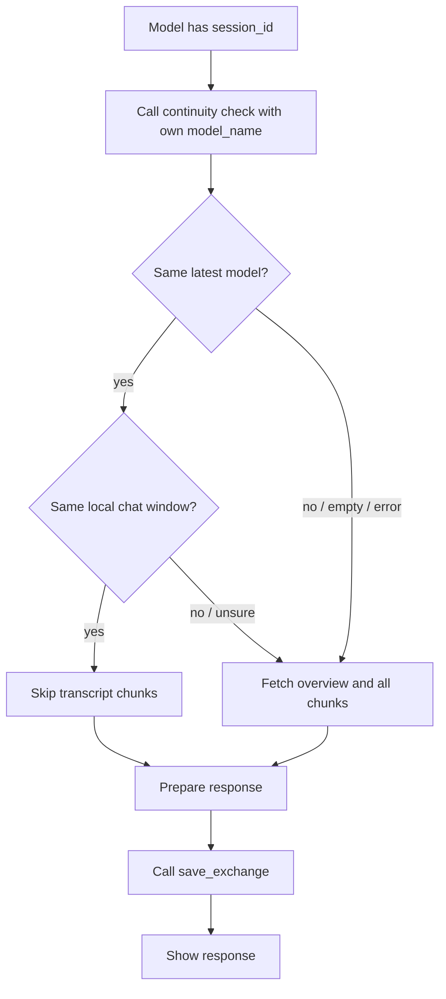

# Session Continuity Check Tool

## Summary

Add a small MCP continuity check that lets a model ask whether the latest saved exchange in a session was written by the same declared `model_name`. When the same model is continuing in the same chat window, the model may skip fetching transcript chunks and proceed from its local context, while still saving the final response through `save_exchange`.

---

## Problem Frame

The current protocol requires every model turn to call `get_session_overview` and fetch every `get_session_transcript_chunk` before answering. That is safe when models alternate, but wasteful when the user talks to the same model several times in the same client window: the model already has the immediately prior local context, and repeated chunk fetching does not add value.

The bridge currently stores `model_name` as caller-supplied text in each exchange. It does not have a stable harness ID or client registration identity for the speaking model, so this plan uses `model_name` as the pragmatic continuity key.

---

## Requirements

- R1. A model can perform a lightweight continuity check for an established `session_id` before deciding whether to fetch transcript chunks.
- R2. The continuity check compares the caller's declared `model_name` with the latest non-deleted exchange's `model_name`.
- R3. The check returns enough information for the model to choose safely: whether the session exists, whether any exchange exists, the latest speaker name, and whether transcript chunks should be fetched.
- R4. Same-model continuity permits skipping chunk fetches only when the model is still in the same active chat window and has the previous exchange in local context.
- R5. Ambiguous states fall back to the existing safe behavior: fetch overview and all transcript chunks before answering.
- R6. `save_exchange` remains mandatory before showing the response to the user, regardless of whether chunk fetching was skipped.
- R7. Public model instructions, README protocol docs, and server instructions describe the new optimized flow without removing the existing full-fetch fallback.
- R8. Tests cover same-model, different-model, empty-session, unknown-session, blank-model-name, and deleted-latest-exchange behavior.

---

## High-Level Technical Design

The server-side check should be intentionally narrow. It should not infer a model's identity from OAuth client IDs, MCP client registrations, or user-agent data, because current exchanges are keyed only by the `model_name` supplied to `save_exchange`. The tool should compare normalized names conservatively and return a clear fallback decision when the input is empty or the latest speaker cannot be trusted.

---

## Key Technical Decisions

- `model_name` is the continuity key: This matches the current persistence model and avoids adding a larger identity-registration system before there is a proven need.
- Server returns a decision, not just a name: Returning a boolean such as `should_fetch_transcript` reduces brittle reasoning in model prompts and makes the safe fallback explicit.
- Same-window knowledge stays client-side: The bridge can know who saved the latest exchange, but it cannot know whether the current model is running in the same chat window. Model instructions must keep that second condition visible.
- Deleted exchanges do not count as latest continuity: The check should use the same non-deleted transcript view that regular chunk rendering uses, so admin corrections do not accidentally preserve stale continuity.
- Hallucinated identity is an accepted operational risk: The user accepts the possibility that a model may sometimes declare a wrong `model_name`; monitoring and admin correction are the initial mitigation.

---

## Implementation Units

### U1. Storage Helper For Latest Active Exchange

- **Goal:** Add a small persistence helper that returns the most recent non-deleted exchange for a session, ordered consistently with transcript chronology.
- **Files:** `app/storage.py`, `tests/test_sessions.py`.
- **Patterns:** Reuse `ExchangeRecord` and the existing `list_exchanges(..., include_deleted=False)` semantics rather than creating a new record type.
- **Test Scenarios:** Returns `None` for empty sessions, ignores deleted exchanges, and returns the newest active exchange after multiple saves.
- **Verification:** Unit tests exercise the helper directly or through the MCP tool if keeping it private is cleaner.

### U2. MCP Tool For Session Continuity

- **Goal:** Add a public MCP tool that accepts `session_id` and caller `model_name`, checks the latest active exchange, and returns a safe fetch decision.
- **Files:** `app/main.py`, `tests/test_sessions.py`.
- **Patterns:** Match existing tool style: return `{"ok": False, "error": ...}` for unknown sessions or invalid input rather than raising across the MCP boundary.
- **Test Scenarios:** Same declared model returns a skip-eligible decision; different model, blank model, no exchanges, and unknown session return fetch-required or error decisions.
- **Verification:** Public tool-list tests include the new tool, and behavior tests call the Python tool function directly.

### U3. Model Protocol Documentation

- **Goal:** Update the protocol so models call the continuity check before chunk fetching and only skip chunks under the accepted same-model same-window condition.
- **Files:** `README.md`, `docs/model-instructions.md`, `docs/project-prompt-template.md`, `docs/limitations.md`.
- **Patterns:** Keep the old full-fetch path as the safe fallback. Do not phrase skipping as globally safe just because the latest `model_name` matches.
- **Test Scenarios:** Existing prompt-document tests are updated to assert the new tool and the retained chunk fallback are documented.
- **Verification:** Documentation review confirms `save_exchange` remains mandatory and timestamp guidance remains intact.

### U4. Server Instructions Update

- **Goal:** Fit the optimized protocol into the short FastMCP server instructions without exceeding the existing publication-readiness guard.
- **Files:** `app/main.py`, `tests/test_sessions.py`.
- **Patterns:** Preserve the current concise instruction style and keep sensitive/personal wording out of server instructions.
- **Test Scenarios:** Existing instruction tests still pass and assert the new continuity tool is mentioned.
- **Verification:** The length guard in `test_server_instructions_are_publication_ready` remains meaningful.

---

## Acceptance Examples

- AE1. Same model in same window: Claude saved the latest exchange as `Claude`; Claude calls the continuity check with `model_name="Claude"` and receives a skip-eligible response, so it may answer from local context and then call `save_exchange`.
- AE2. Different model handoff: Claude saved the latest exchange; ChatGPT calls the continuity check with `model_name="ChatGPT"` and receives a fetch-required response, so it fetches overview and all transcript chunks before answering.
- AE3. Empty session: A newly created session has no exchanges; the continuity check indicates transcript fetch is required or no skip is available, so the model follows the normal setup path.
- AE4. Fresh window with same model: ChatGPT sees that the latest exchange was also `ChatGPT`, but it does not have the prior local chat context, so instructions require fetching transcript chunks anyway.
- AE5. Admin deletion: The latest saved exchange is deleted in admin; the continuity check evaluates the latest remaining active exchange, matching what future transcript chunks would contain.

---

## Scope Boundaries

- This plan does not introduce stable model accounts, cryptographic identity, per-harness registration, or OAuth-client-to-model mapping.
- This plan does not change the `save_exchange` schema beyond using the existing `model_name` field as the continuity key.
- This plan does not add admin UI for continuity state, although the API response should be understandable enough to debug from logs or direct tool calls.
- This plan does not remove chunking. It adds a narrow optimization before the existing chunk-fetch path.

---

## System-Wide Impact

The change alters the agent-facing protocol, so every place that tells models how to use MCP Session Bridge must be updated together. The behavior remains backward compatible because clients that keep using `get_session_overview` and `get_session_transcript_chunk` on every turn still work. The optimization is opt-in through prompt compliance and tool selection.

The performance win is reduced transcript tool traffic during same-model consecutive turns. The main safety trade-off is that a model can skip chunk fetching after declaring a matching `model_name`, even if its identity string is wrong. That risk is intentionally accepted for this iteration and should be monitored through transcript review.

---

## Risks & Dependencies

- **Model self-identification drift:** Models may sometimes save as a different name than expected. Mitigation is conservative normalization, clear prompt wording, and admin monitoring.
- **Same-model fresh windows:** The server cannot detect whether the caller has local context. Mitigation is explicit model-instruction language that same-model is not enough by itself.
- **Prompt adoption lag:** Existing clients may not immediately use the new tool. This is safe because the old full-fetch protocol remains valid.
- **Instruction length pressure:** Server instructions already have a test cap. The implementation may need compact wording and fuller explanation in docs.

---

## Documentation / Operational Notes

After implementation and deploy, model-specific system prompts should tell each model to pass a stable self-name to both the continuity check and `save_exchange`. Recommended examples are `Claude`, `ChatGPT`, `Codex`, `Gemini`, or another consistent label the user chooses for that client.

Operationally, the user should monitor the admin transcript for unexpected `model_name` values after rollout. If identity drift becomes frequent, a later plan can add explicit per-client `model_id` configuration or alias management.

---

## Sources / Research

- `app/main.py` defines current MCP tools and stores `model_name` through `save_exchange`.
- `app/storage.py` persists exchanges with `model_name TEXT NOT NULL` and lists non-deleted exchanges for transcript rendering.
- `docs/project-prompt-template.md` currently instructs models to pass their own model name to `save_exchange`.
- `tests/test_sessions.py` contains the public tool-list, chunking, timestamp, and server-instruction tests that should absorb the new protocol.
