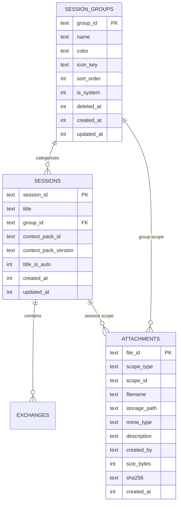
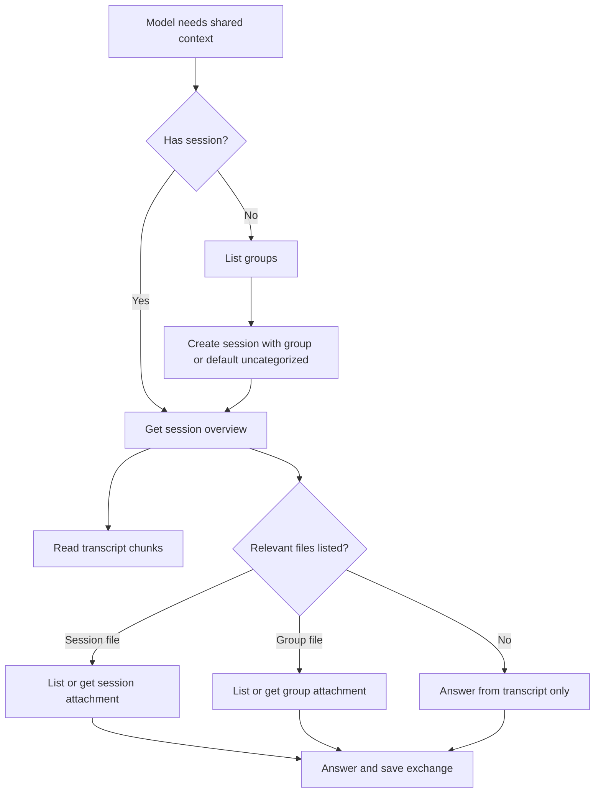

# Session Groups And Shared Files - Plan

## Goal Capsule

| Field | Value |
|---|---|
| Objective | Add durable, user-managed Session Groups first, then add explicit shared files for sessions and groups so models can coordinate around categorized conversations and reusable context. |
| Authority | User request in this planning session, existing MCP Session Bridge architecture, repository conventions in `CONTRIBUTING.md`, and security guidance cited in Sources & Research. |
| Execution profile | Standard multi-surface feature: persistent schema, MCP tools, admin API, admin UI, documentation, and focused tests. |
| Stop conditions | Stop if implementing group or file permissions requires a larger auth model than the existing owner/admin plus MCP scope can responsibly support. |
| Tail ownership | The implementation should include local custom group management, while leaving binary file support, custom icon uploads, and MCP Resources integration as explicit follow-up work. |

---

## Product Contract

### Summary

MCP Session Bridge currently stores a flat list of sessions and explicitly says it is not a file-context delivery system.
This plan adds a category layer called Session Groups, seeded with `uncategorized`, `brainstorming`, and `health`, and lets each deployment create its own local groups such as `Ideas`.
It then adds explicit text attachment support that can belong either to a single session or to a group.
The first stage gives users and models a shared vocabulary for categorizing conversations; the second stage lets that vocabulary become durable context without stuffing whole documents into transcripts.

### Problem Frame

Users need to sort model-to-model conversations by topic, especially when one topic spans several sessions, and different deployments need their own categories.
They also need a future-safe way to share artifacts such as Markdown plans between models and to keep long-lived topic context, like Health notes, independent from any one conversation.
The bridge should make these objects visible to both the admin UI and agent tools while keeping local user-created groups out of the public repository and keeping storage narrow, authenticated, and easy to reason about.

### Requirements

**Session Groups**

- R1. The bridge seeds three stable system groups: `uncategorized`, `brainstorming`, and `health`.
- R2. `brainstorming` uses a blue visual treatment and a brain icon; `health` uses a red visual treatment and a generic medical plus icon that does not mimic the protected Red Cross emblem.
- R3. New sessions default to `uncategorized` when no group is supplied by the creating model or caller.
- R4. Models can fetch the current group list before creating a session and can create a session in a valid group.
- R5. Session list and overview responses include group metadata compactly enough for models to select the right conversation without an extra lookup when possible.
- R6. The admin sessions panel lets the owner filter sessions by group and move a selected session from one group to another.
- R16. The admin sessions panel lets the owner create, rename, recolor, re-icon, and delete custom groups without editing code or committed files.
- R17. User-created groups are stored only in local runtime storage and are never written into public docs, examples, fixtures, or source-controlled configuration.
- R18. Deleting a custom group requires a destination group, defaults that destination to `uncategorized`, and reassigns sessions and group-scoped attachments without deleting transcript content.
- R19. Group icons come from an application-owned icon gallery with stable `icon_key` values, including practical categories such as folder, money, book, graduation, pencil, code, terminal, music, food, palette, health, tools, travel, world, legal, science, ideas, heart, and plants.
- R20. `list_session_groups` returns both system and user-created groups so models can resolve a user phrase such as "Ideas" to the current local `group_id` before creating a session.

**Shared Files**

- R7. The bridge supports explicit text attachments scoped to either one session or one group.
- R8. Models can upload, list, and retrieve attachments through MCP tools without relying on transcript text as the file transport.
- R9. Session overview exposes a compact attachment manifest for the selected session and its group, but not full file contents.
- R10. Group-scoped files are visible from every session in that group so long-lived topic context can survive individual conversations.
- R11. Attachment uploads preserve original display filename, MIME type, description, creator, size, hash, scope, and timestamps while storing content under generated server filenames.

**Safety, Documentation, and Compatibility**

- R12. Existing sessions migrate into `uncategorized` without losing transcript data, summaries, or admin correction behavior.
- R13. Attachment storage validates scope IDs, file IDs, filenames, MIME types, sizes, and path boundaries before reading or writing content.
- R14. Public docs and model instructions describe groups and explicit attachments, and they replace the old blanket claim that the bridge is not a file-context delivery system.
- R15. Existing MCP tools remain backwards compatible for clients that call `create_session(title)` without a group.

### Key Flows

- F1. Model creates a categorized session.
  - **Trigger:** A model wants to start a new shared conversation in a known topic area.
  - **Actors:** Model client, MCP server.
  - **Steps:** The model calls `list_session_groups`, selects `brainstorming`, then calls `create_session` with that group.
  - **Outcome:** The session is stored with group metadata and appears under the correct admin filter.
  - **Covered by:** R1, R3, R4, R5.

- F2. Admin reclassifies a conversation.
  - **Trigger:** The owner sees a conversation in the wrong group.
  - **Actors:** Admin owner, admin UI, admin API.
  - **Steps:** The owner filters or selects a session, opens the group control, chooses the target group, and saves.
  - **Outcome:** The session list, selected session header, and MCP session metadata reflect the new group.
  - **Covered by:** R5, R6, R12.

- F5. Admin creates a custom group for local use.
  - **Trigger:** The owner wants a new topic category such as Ideas.
  - **Actors:** Admin owner, admin UI, admin API, MCP server.
  - **Steps:** The owner clicks add group, enters a name, chooses a color and icon from the gallery, and saves.
  - **Outcome:** The group is stored in the local database, appears in admin filters, and appears in `list_session_groups` for models.
  - **Covered by:** R16, R17, R19, R20.

- F6. Admin deletes a custom group without losing conversations.
  - **Trigger:** The owner no longer wants a custom category.
  - **Actors:** Admin owner, admin UI, admin API.
  - **Steps:** The owner starts deletion, confirms a destination group, and saves.
  - **Outcome:** Sessions and group-scoped attachments move to the destination group, the custom group no longer appears in active group lists, and system groups remain protected.
  - **Covered by:** R12, R16, R18.

- F3. Model shares a Markdown artifact with later models.
  - **Trigger:** A model writes a plan or note that should be available to other models in the same session.
  - **Actors:** Model client, MCP server.
  - **Steps:** The model uploads a text attachment scoped to the session; a later model sees the file manifest in overview, lists files, and retrieves the specific file.
  - **Outcome:** The artifact travels through the bridge as a durable file record instead of transcript copy-paste.
  - **Covered by:** R7, R8, R9, R11, R13.

- F4. Model uses group-level Health context.
  - **Trigger:** A user starts a new Health session and wants existing Health notes available.
  - **Actors:** Model client, MCP server.
  - **Steps:** The model creates or selects a Health session, reads overview, sees group attachments, and retrieves only the files it needs.
  - **Outcome:** Topic-level context is available across sessions without merging all Health transcripts.
  - **Covered by:** R7, R9, R10, R13.

### Acceptance Examples

- AE1. Given an existing database with sessions and no group column, when the server starts after the migration, then every existing session lists `uncategorized` as its group.
- AE2. Given a model calls `create_session` without `group_id`, when the session is created, then the response and session overview both report `uncategorized`.
- AE3. Given a model calls `create_session` with `group_id="brainstorming"`, when the session is listed in admin, then it appears under the Brainstorming filter with the blue brain treatment.
- AE4. Given the owner changes a selected session from Brainstorming to Health, when the admin list refreshes, then the session appears under Health and no exchanges are changed.
- AE5. Given a model uploads `plan.md` to a session, when another model reads that session overview, then it sees file metadata and can retrieve the file content by `file_id`.
- AE6. Given a model uploads a group-scoped Health note, when another Health session overview is read, then the group file appears in the group attachment manifest.
- AE7. Given a model tries to upload an unsupported file type, oversized content, an empty filename, or an unknown scope, then the tool returns a structured error and stores no file.
- AE8. Given the owner creates a custom group named Ideas, when a model calls `list_session_groups`, then the response includes Ideas with its local `group_id`, color, and icon key.
- AE9. Given the owner deletes Ideas and chooses Uncategorized as the destination, when the operation completes, then Ideas is absent from active group lists and its sessions still exist under Uncategorized.
- AE10. Given a custom group exists only in the local database, when the repository is inspected for tracked changes, then no user group data appears in source-controlled files.

### Scope Boundaries

#### In Scope

- System-seeded Session Groups with stable IDs, colors, and safe icon keys.
- Custom group creation, editing, deletion, and icon selection in the admin sessions panel.
- Session assignment at creation time and reassignment through the admin panel.
- MCP group discovery and categorized session metadata.
- Text-based attachment MVP for session and group scopes.
- Admin visibility for group assignment and attachment metadata.
- Documentation updates that explain explicit attachment behavior and remaining limitations.

#### Deferred to Follow-Up Work

- User-uploaded custom SVG icons or external icon packs.
- Nested groups, group sharing between deployments, and group import/export.
- Binary attachments, PDFs, DOCX parsing, preview generation, antivirus scanning, and content disarm workflows.
- Native MCP Resources exposure for attachments after the tool-based MVP proves the data model.
- Per-group retention policies, quotas, archival workflows, and export/delete tools.
- Fine-grained authorization beyond the current owner/admin cookie and authenticated MCP scope.

#### Outside This Product's Identity

- Automatic ingestion of arbitrary project directories.
- Silent automatic inclusion of all group files into every model context.
- Public file hosting or unauthenticated download URLs.

### Assumptions

- Seed groups are system-managed and protected from deletion, while user-created groups are local database records.
- Group deletion means category removal and reassignment, not transcript or attachment deletion.
- Attachments in this plan are UTF-8 text payloads suitable for Markdown, JSON, and plain text.
- Models fetch file content intentionally by tool call; overview returns metadata only to avoid token-heavy accidental context loading.

---

## Planning Contract

### Key Technical Decisions

- KTD1. Store Session Groups as first-class SQLite records and put `group_id` on `sessions`.
  This matches the existing SQLite-backed `Store` boundary in `app/storage.py`, supports migration with `_ensure_column`, keeps user-created group data in local runtime storage, and avoids encoding category state inside titles or context packs.

- KTD2. Seed system groups idempotently while preserving user groups.
  The current app has no migration runner, so `Store._init_schema()` should create `session_groups`, add `sessions.group_id`, and upsert protected system groups without clobbering user-created group records.

- KTD3. Store group icons as an allowlisted `icon_key`, not arbitrary SVG from the database.
  The UI owns a compact SVG icon gallery inspired by common chat category pickers, while the database stores safe symbolic values plus colors.

- KTD4. Keep group creation admin-owned and group use model-friendly.
  Admin APIs own create, update, and delete for groups; MCP exposes `list_session_groups` and categorized `create_session` so models can use the current local catalog without mutating it.
- KTD10. Soft-delete custom groups after reassignment and never delete system groups.
  Soft deletion keeps old references auditable, avoids breaking historical records, and lets active group lists filter out deleted categories.

- KTD5. Use a generic attachment metadata table with a scoped owner.
  A single attachment model with `scope_type` and `scope_id` supports both session files and group files, while Store methods validate that session scopes reference real sessions and group scopes reference real groups.

- KTD6. Store attachment content on disk and metadata in SQLite.
  This follows the existing `ContextPackStore` pattern of atomic filesystem writes with hash metadata, while avoiding SQLite BLOB growth for user-supplied files.

- KTD7. Limit the attachment MVP to text payloads with explicit size and MIME allowlists.
  The MCP tool surface accepts string content naturally; binary data, decompression, and document parsing increase risk and should wait for a follow-up design.

- KTD8. Overview returns attachment manifests, not content.
  This preserves the current chunking discipline in `get_session_overview`: models learn what exists, then make deliberate bounded reads.

- KTD9. Treat Health as a label, not a medical advice mode.
  Group metadata and docs should avoid implying clinical guidance, and attachment handling should emphasize privacy responsibility for sensitive notes.

### High-Level Technical Design

### Sequencing

1. Build Session Groups storage with protected seed groups and local custom groups first.
2. Add admin group CRUD, filtering, reassignment, and deletion flows once storage is stable.
3. Add MCP group discovery and categorized session creation against the dynamic group catalog.
4. Update tests and docs for grouped sessions before starting attachments.
5. Add attachment storage and tools behind the same Store/settings conventions.
6. Surface attachment manifests in overview and docs after read/write tools are tested.

### System-Wide Impact

- **Data model:** Existing sessions gain a default group; attachment metadata introduces a new persistent object with filesystem coupling.
- **Agent/tool parity:** Models gain group discovery and attachment workflows matching the admin-visible state, while group mutation stays admin-owned.
- **Admin UI:** The left session list becomes grouped/filterable, selected session metadata gains a group control, and the owner can manage the local group catalog.
- **Repository hygiene:** Runtime group records stay in the SQLite data store and must not be generated into tracked examples or public configuration.
- **Privacy posture:** Group-level Health files can contain sensitive notes, so docs and validation must make explicit that authenticated bridge clients can read stored context.
- **Prompt protocol:** Server instructions and project prompt need a compact update without exceeding the current publication-ready instruction budget checked in tests.

### Sources & Research

- `README.md` defines the current bridge as a remote MCP server for shared multi-model memory and lists current public tools.
- `app/storage.py` owns SQLite schema creation, compatibility columns, sessions, exchanges, and admin event persistence.
- `app/main.py` defines FastMCP tools and currently exposes flat `create_session`, `list_sessions`, and `get_session_overview`.
- `app/admin.py` protects admin mutation routes with CSRF and returns session payloads for `admin-viewer.html`.
- `admin-viewer.html` owns the current sessions sidebar, search, selected transcript view, offline demo fallback, and mutation fetch helper.
- `app/context_packs.py` demonstrates safe IDs, atomic file writes, hash metadata, manifest/index handling, and path-boundary checks.
- `tests/test_sessions.py`, `tests/test_admin.py`, and `tests/test_context_packs.py` show the test style for storage, MCP tools, admin CSRF, and file-like stores.
- OWASP File Upload Cheat Sheet recommends allowlisted extensions, not trusting user-supplied content type alone, generated filenames, file size limits, authenticated uploads, storage outside webroot, least-privilege permissions, and CSRF protection for uploads: https://cheatsheetseries.owasp.org/cheatsheets/File_Upload_Cheat_Sheet.html.
- MCP Resources specification defines resources as URI-addressed context, supports list/read operations, text and binary content, annotations, and URI/access validation requirements: https://modelcontextprotocol.io/specification/2025-06-18/server/resources.

---

## Implementation Units

### U1. Add Session Group Persistence

**Goal:** Introduce durable local group records and assign every session to a valid active group.

**Requirements:** R1, R2, R3, R5, R12, R16, R17, R18, R19, R20.

**Dependencies:** None.

**Files:** `app/storage.py`, `tests/test_sessions.py`, `.gitignore`.

**Approach:** Add a `SessionGroupRecord` dataclass, create `session_groups`, add `sessions.group_id` with `uncategorized` default, and seed the three protected system groups during Store initialization.
Extend `SessionRecord` and session row conversion to include group metadata or group ID without breaking existing callers.
Prefer helper methods such as `list_session_groups`, `create_session_group`, `update_session_group`, `delete_session_group`, `get_session_group`, and `set_session_group` so MCP and admin routes do not write SQL directly.
Keep user groups in the runtime SQLite database, and add any new runtime directories to `.gitignore` rather than writing user group definitions into source-controlled files.

**Execution note:** Add migration-style characterization tests before modifying existing session creation behavior.

**Patterns to follow:** `Store._init_schema`, `Store._ensure_column`, `_session_from_row`, existing `title_is_auto` migration coverage in `tests/test_sessions.py`.

**Test scenarios:**

- Happy path: creating a fresh Store seeds exactly `uncategorized`, `brainstorming`, and `health` with expected names, colors, icon keys, sort order, and system flags.
- Happy path: creating a custom group named Ideas stores a local non-system group with slug-derived `group_id`, selected color, and selected icon key.
- Happy path: creating a session without a group stores `uncategorized`.
- Happy path: creating a session with `brainstorming` or a custom Ideas group stores that group.
- Edge case: reopening an existing database without `group_id` migrates old sessions to `uncategorized`.
- Edge case: creating a duplicate group name or duplicate group ID returns a clear error and does not modify existing groups.
- Edge case: deleting a custom group reassigns sessions and group-scoped attachments to the destination group and marks the old group inactive.
- Error path: deleting a system group returns a clear error and leaves all sessions unchanged.
- Error path: creating or updating a session with an unknown group raises a clear `ValueError` and stores no partial change.
- Integration: `list_sessions` returns active group fields without changing exchange counts or deleted exchange counts.
- Repository hygiene: custom group creation changes only the local database, not tracked docs, examples, or source files.

**Verification:** Storage tests prove defaulting, explicit assignment, custom group CRUD, deletion reassignment, migration, local-only persistence, and list payload behavior while all existing transcript tests still pass.

### U2. Expose Session Groups Through MCP Tools

**Goal:** Let models discover groups and create categorized sessions while preserving old clients.

**Requirements:** R3, R4, R5, R15, R20.

**Dependencies:** U1.

**Files:** `app/main.py`, `app/session_package.py`, `tests/test_sessions.py`.

**Approach:** Add `list_session_groups` as a public MCP tool.
Extend `create_session` with optional `group_id`, validate it through Store, and include group metadata in the response.
Extend `list_sessions` and `get_session_overview` with compact group metadata.
Keep MCP group mutation out of scope so models use the local catalog but admin remains the authority for creating and deleting categories.
Update `SERVER_INSTRUCTIONS` only if the extra step can fit the existing concise instruction style; otherwise rely on docs and tool descriptions.

**Patterns to follow:** Existing `create_session`, `list_sessions`, `get_session_overview`, and the test that asserts public tool names in `tests/test_sessions.py`.

**Test scenarios:**

- Happy path: `list_session_groups` returns sorted groups with IDs, names, colors, and icon keys.
- Happy path: `list_session_groups` includes a custom Ideas group created through Store/admin APIs.
- Happy path: `create_session("Plan", "brainstorming")` and `create_session("Plan", "ideas")` return the chosen group and Store persists it.
- Backwards compatibility: `create_session("Plan")` still works and reports `uncategorized`.
- Error path: `create_session` with a deleted group returns `{"ok": false, "error": ...}`.
- Error path: `create_session` with an unknown group returns `{"ok": false, "error": ...}` rather than raising through the tool boundary.
- Integration: `get_session_overview` includes group metadata and still omits transcript content.
- Integration: the MCP public tool list includes `list_session_groups` and keeps context-pack internals hidden.

**Verification:** MCP-facing tests cover old and new create flows, group discovery, overview metadata, and unchanged transcript chunking.

### U3. Add Admin Group Management, Filtering, And Reassignment

**Goal:** Make the local group catalog visible and manageable in `/admin/sessions`.

**Requirements:** R2, R5, R6, R12, R16, R17, R18, R19, R20.

**Dependencies:** U1.

**Files:** `app/admin.py`, `app/main.py`, `admin-viewer.html`, `tests/test_admin.py`.

**Approach:** Add admin API support for listing, creating, updating, deleting, and reordering groups, plus changing a session group with CSRF protection.
Return group metadata in `_session_payload` and session list payloads.
In the sidebar, render a compact group filter below the Sessions label with All plus system and custom group icons.
Render group badges in session buttons and a group select in the selected session header or metadata area.
Add an Add Group flow with name, color, and icon picker controls.
Use an inline SVG allowlist keyed by `icon_key`; seed it with simple line icons inspired by the provided category-picker reference, including folder, money, book, graduation, pencil, code, terminal, music, food, palette, health, tools, travel, world, legal, science, ideas, heart, and plants.
Protect system groups from delete, and require a destination group when deleting custom groups.
Update offline demo data handling so the viewer remains reviewable without a live backend.

**Patterns to follow:** `api_update_timezone` for authenticated mutations, `api_sessions` and `api_session` payload shape, `admin-viewer.html` state/render/mutate helpers, demo fallback in `demoApi`.

**Test scenarios:**

- Happy path: logged-in admin can list sessions and see group metadata.
- Happy path: logged-in admin with CSRF can create Ideas with a selected icon and color, then see it in group filters.
- Happy path: logged-in admin with CSRF can rename, recolor, and re-icon a custom group.
- Happy path: logged-in admin with CSRF can move a session from `brainstorming` to `health`.
- Happy path: logged-in admin with CSRF can delete a custom group by choosing `uncategorized` as the destination and see sessions move.
- Error path: moving a session without CSRF returns 403 and leaves the session unchanged.
- Error path: creating, editing, or deleting a group without CSRF returns 403 and leaves groups unchanged.
- Error path: moving to an unknown group returns 400 or 404 and leaves the session unchanged.
- Error path: deleting `uncategorized`, `brainstorming`, or `health` returns a clear error and leaves groups unchanged.
- Edge case: duplicate custom group names, invalid colors, and unknown icon keys show validation errors.
- Integration: after reassignment, the session's exchange count and transcript content are unchanged.
- UI smoke expectation: the group filter, session badge, group manager, icon picker, and selected-session group control render from API payloads and update local state after mutation.

**Verification:** Admin API tests cover auth, CSRF, group CRUD, deletion reassignment, session reassignment, and failure; manual browser review confirms group filters, icon picker, badges, and controls do not overlap existing sidebar controls.

### U4. Update Group Documentation And Demo Data

**Goal:** Make grouped sessions understandable to humans and model clients before attachment behavior changes the promise of the product.

**Requirements:** R4, R5, R14, R15, R16, R17, R19, R20.

**Dependencies:** U2, U3.

**Files:** `README.md`, `docs/model-instructions.md`, `docs/project-prompt-template.md`, `docs/limitations.md`, `docs/security.md`, `examples/sample-session.json`, `examples/sample-session.md`, `scripts/demo_session.py`, `scripts/session_audit.py`, `tests/test_public_onboarding.py`, `tests/test_sessions.py`.

**Approach:** Update the tool list, typical model flow, limitations, and prompt template to mention group discovery and categorized session creation.
Adjust demo and export payloads only where they display session metadata, keeping transcript rendering stable.
Document that user-created groups live in local runtime storage and should not be committed as examples, fixtures, or public defaults.
Keep public docs in English per `CONTRIBUTING.md`.

**Patterns to follow:** Existing README tool table, `docs/model-instructions.md` short protocol, `tests/test_public_onboarding.py` documentation assertions, `scripts/session_audit.py` viewer payload conventions.

**Test scenarios:**

- Happy path: demo session export includes group metadata with `uncategorized` default.
- Documentation: public onboarding tests find the new tools in README and model instructions.
- Documentation: admin docs explain custom group creation, deletion reassignment, icon gallery limits, and local-only storage.
- Regression: project prompt mentions group discovery while retaining accurate no-automatic-file-ingestion wording before attachment units land.
- Integration: offline viewer payload remains backwards-compatible for transcripts that lack group fields.

**Verification:** Documentation tests and session audit tests pass, and docs consistently describe the group-first workflow.

### U5. Add Attachment Storage Foundation

**Goal:** Create safe, reusable storage for text attachments scoped to sessions or groups.

**Requirements:** R7, R10, R11, R12, R13, R18.

**Dependencies:** U1.

**Files:** `app/settings.py`, `app/storage.py`, `app/session_attachments.py`, `.gitignore`, `tests/test_sessions.py`, `tests/test_security.py`.

**Approach:** Add `BRIDGE_ATTACHMENTS_DIR` with a default under `data/session-attachments` and ignore that runtime directory.
Create an attachment store module for filesystem writes and reads, and keep attachment metadata in SQLite.
Use generated server filenames or sharded paths based on `file_id`; keep original filenames as display metadata only.
Validate `scope_type`, `scope_id`, text content, filename length, safe display characters, MIME allowlist, and size limit before writing.
Write files atomically, compute SHA-256 from stored content, and rollback metadata if content write fails.

**Execution note:** Start with failing tests for path traversal, unknown scope, and oversized content before implementing write behavior.

**Patterns to follow:** Atomic write and safe ID helpers in `app/context_packs.py`; SQLite schema style in `app/storage.py`.

**Test scenarios:**

- Happy path: saving a session-scoped Markdown attachment writes content outside the database and records metadata with hash, size, scope, creator, and timestamps.
- Happy path: saving a group-scoped text attachment for `health` is listable from that group.
- Happy path: deleting a custom group with a destination group reassigns group-scoped attachments to the destination group.
- Edge case: duplicate display filenames generate distinct file IDs and do not overwrite content.
- Edge case: empty content, empty filename, too-long filename, unsupported MIME type, and oversized content are rejected.
- Error path: path traversal characters in filename or file ID cannot escape the attachments root.
- Error path: unknown session or group scope stores no metadata and writes no file.
- Integration: moving sessions between groups does not move group attachments or change session-scoped attachment ownership.

**Verification:** Attachment storage tests prove metadata/content consistency, rollback behavior, and path safety.

### U6. Expose Attachment MCP Tools And Overview Manifests

**Goal:** Let models upload, list, and retrieve shared files without bloating transcripts.

**Requirements:** R7, R8, R9, R10, R11, R13, R14.

**Dependencies:** U5.

**Files:** `app/main.py`, `app/session_package.py`, `tests/test_sessions.py`.

**Approach:** Add scoped attachment tools with explicit names.
The MCP surface is `upload_session_file`, `list_session_files`, `get_session_file`, `upload_group_file`, `list_group_files`, and `get_group_file` because the names are easy for models to choose.
Return metadata after upload, list compact records, and return content only from get tools.
Extend `get_session_overview` with compact `session_files` and `group_files` manifests that include counts, IDs, filenames, descriptions, MIME types, sizes, hashes, and timestamps.
Keep transcript chunks unchanged.

**Patterns to follow:** Existing `upload_session_file`, `upload_group_file`, `get_session_overview`, and structured error style in current tools.

**Test scenarios:**

- Happy path: a model uploads `plan.md` to a session, another tool call lists it, and `get_session_file` returns exact content and metadata.
- Happy path: a model uploads a Health group note and a different Health session overview lists it as group context.
- Edge case: overview with many files returns metadata only and stays bounded by a configured manifest limit if one is added.
- Error path: retrieving an unknown `file_id` returns a structured not-found error.
- Error path: retrieving a file through the wrong scope-specific tool returns an error and does not leak content.
- Integration: transcript chunk count and transcript SHA are unchanged by adding attachments.

**Verification:** MCP tool tests cover upload/list/get for both scopes, overview manifests, structured errors, and transcript isolation.

### U7. Add Attachment Admin Visibility And Documentation

**Goal:** Make explicit files inspectable and explain the new storage model.

**Requirements:** R9, R10, R11, R13, R14.

**Dependencies:** U5, U6.

**Files:** `app/admin.py`, `app/main.py`, `admin-viewer.html`, `README.md`, `docs/model-instructions.md`, `docs/project-prompt-template.md`, `docs/limitations.md`, `docs/security.md`, `tests/test_admin.py`, `tests/test_public_onboarding.py`.

**Approach:** Add read-only admin attachment metadata for the selected session and its group.
Defer attachment deletion to follow-up work rather than shipping a half-designed lifecycle.
Update docs to explain explicit file upload, text-only MVP, group-vs-session scope choice, size/type limits, privacy responsibility, and the fact that files are not automatically included in every answer.
Revise old "not a file-context delivery system" language into "not automatic project-file ingestion."

**Patterns to follow:** Existing admin selected-session metadata rendering, no-store admin headers, docs wording in `docs/security.md` and `docs/limitations.md`.

**Test scenarios:**

- Happy path: admin session detail payload includes session and group attachment metadata without file contents.
- Happy path: admin UI can render attachment names, scopes, sizes, and hashes without breaking transcript controls.
- Error path: unauthenticated admin API requests for attachment metadata return 401.
- Documentation: README, model instructions, and limitations consistently describe explicit text attachments and remaining non-goals.
- Security: docs warn that Health group files may contain sensitive information and authenticated bridge clients can retrieve them.

**Verification:** Admin tests cover authentication and payload shape; documentation tests cover changed product promise and model flow.

---

## Verification Contract

| Gate | Applies to | Done signal |
|---|---|---|
| Storage unit tests | U1, U5 | Group migration/defaulting, custom group CRUD, deletion reassignment, local-only persistence, and attachment persistence/path safety are covered. |
| MCP tool tests | U2, U6 | Public tool list, dynamic group catalog, create/list/overview, upload/list/get, and error paths are covered. |
| Admin API tests | U3, U7 | Login, CSRF, group CRUD, session reassignment, group deletion reassignment, and attachment metadata access behave as expected. |
| Documentation tests | U4, U7 | README, model instructions, project prompt, limitations, and security docs match the new behavior. |
| Full suite | All units | `uv run pytest` passes with no regression to OAuth, transcript chunking, or admin correction tests. |
| Manual admin UI review | U3, U7 | `/admin/sessions` shows group filters, badges, icon gallery, add/edit/delete group flows, reassignment control, and attachment metadata without layout overlap on desktop and narrow viewports. |

---

## Definition of Done

- Session Groups are persisted, seeded, locally customizable, returned by MCP tools, visible in admin, and assigned by default to existing and new sessions.
- User-created groups can be created, edited, deleted with reassignment, and selected from an allowlisted icon gallery without writing user group data into tracked files.
- Admin can filter by group and move sessions between groups without changing transcript exchanges.
- Text attachments can be uploaded, listed, and retrieved for both session and group scopes through authenticated MCP tools.
- Session overview advertises compact session and group file manifests while transcript chunks remain content-only.
- Attachment storage rejects invalid scope IDs, unsafe filenames, unsupported MIME types, oversize content, and path traversal attempts.
- Docs and model instructions describe group discovery, categorized session creation, explicit attachments, group-level context, and remaining non-goals.
- All new behavior has focused tests, the full test suite passes, and abandoned experimental code is removed from the diff.

---

## Risks & Dependencies

- **Sensitive group context:** Health files may contain private data; the plan relies on existing authenticated MCP clients and admin login, so docs must not overstate privacy isolation.
- **Tool-result size:** Returning full file content through tools can exceed useful model context; the MVP should enforce size limits and keep overview metadata-only.
- **Schema evolution without migrations:** Store initialization must be idempotent and safe for existing SQLite databases.
- **SVG and filename injection:** Rendering icons and filenames in admin must use allowlisted SVGs and text nodes, not raw HTML from storage.
- **Local data leakage:** Demo generation, docs updates, and exports must not turn a user's local custom groups into committed public defaults.
- **Future binary support:** The text-only MVP should leave room for base64/binary resources without shaping current code around unimplemented scanning or preview features.

---

## Future Considerations

- Promote attachments to native MCP Resources after the tool-based workflow proves useful and clients consistently support resource selection.
- Expand the built-in icon gallery and color presets based on real usage.
- Add undo or archive workflows for deleted custom groups if users need recovery beyond soft-delete records.
- Add retention, export, delete, and quota policies before heavy group-level context use.
- Consider a `get_group_overview` tool if group files and group-level summaries become central to model workflows.
