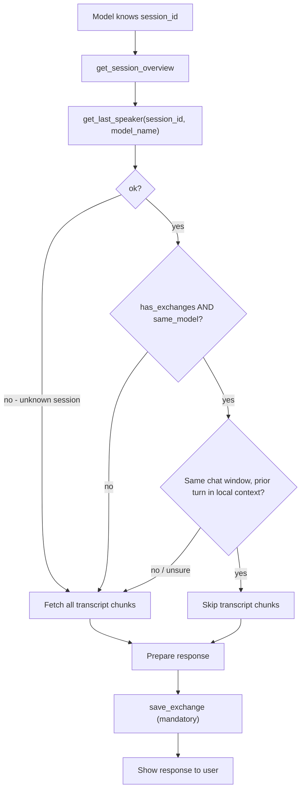

# feat: Add `get_last_speaker` Continuity Check Tool

## Goal Capsule

Give a model a cheap way to learn who wrote the latest saved turn in a session, so that when the *same* model is continuing inside the *same* chat window it can skip re-fetching transcript chunks it already holds locally. The model calls a new lightweight MCP tool, `get_last_speaker`, after `get_session_overview` and before any `get_session_transcript_chunk`. The tool compares the caller's declared `model_name` with the latest active exchange's `model_name` and returns an explicit fetch decision. Every ambiguous case falls back to the existing full-fetch protocol, and `save_exchange` stays mandatory.

This plan supersedes `docs/plans/2026-06-24-session-continuity-check-plan.md`, which is removed as part of this work (U1).

---

## Problem Frame

The current protocol (in `SERVER_INSTRUCTIONS` and `docs/model-instructions.md`) tells every model turn to call `get_session_overview`, then fetch **every** `get_session_transcript_chunk` before answering. That is correct when models alternate (ping-pong), because the answering model has none of the prior turn in its local context.

But users do not always alternate. Sometimes the user talks to the same model several turns in a row inside the same client window. In that case the model already has the immediately prior exchange in its own context — the current turn happens in the same window as the previous one — yet the protocol still makes it re-fetch all chunks. That is wasted tool traffic and latency with no information gain.

The bridge already knows who saved the latest exchange: `save_exchange` persists a caller-supplied `model_name` on every exchange, and `store.list_exchanges()` returns the non-deleted exchanges in chronological order. What is missing is (a) a tool that surfaces the latest speaker as a fast, content-free check, and (b) protocol wording that lets a model skip chunk fetches **only** under the same-model **and** same-window condition.

The bridge cannot prove the second condition (same window) — it has no stable harness identity, only the `model_name` string the caller declares. So this stays a conservative, opt-in optimization keyed on `model_name`, with the same-window judgement left to the model and stated explicitly in the prompt docs.

---

## Requirements

- **R1.** A model can perform a lightweight, content-free continuity check for a known `session_id` before deciding whether to fetch transcript chunks.
- **R2.** The check compares the caller's declared `model_name` with the `model_name` of the latest **non-deleted** exchange.
- **R3.** The response carries enough for a safe decision: whether the session exists, whether any active exchange exists, the latest speaker name, whether the caller matches it, and an explicit `should_fetch_transcript` boolean.
- **R4.** A same-model match makes skipping chunk fetches *eligible*, never automatic — the model must additionally be in the same active chat window with the prior exchange in local context.
- **R5.** Every ambiguous state (unknown session, no exchanges, blank caller name, different speaker) resolves to the existing safe behavior: fetch overview and all chunks.
- **R6.** `save_exchange` remains mandatory before the response is shown to the user, whether or not chunk fetching was skipped.
- **R7.** `SERVER_INSTRUCTIONS`, README, and the protocol docs describe the optimized flow without removing the full-fetch fallback, and `SERVER_INSTRUCTIONS` stays within its 512-character publication cap.
- **R8.** Tests cover same-model, different-model, blank-caller-name, empty-session, unknown-session, and deleted-latest-exchange behavior, plus tool-list and instruction-doc presence.

---

## Key Technical Decisions

- **`model_name` is the continuity key.** It matches the current persistence model and avoids building a model-identity/registration system before there is proven need. (Same decision as the superseded draft; carried forward deliberately.)
- **The tool returns a decision, not just a name.** `should_fetch_transcript` is computed server-side so model prompts do not have to re-derive the safe fallback from raw fields. The raw fields (`latest_model_name`, `same_model`, `has_exchanges`) are also returned for transparency and debugging.
- **Separate tool, not extra overview fields.** Per the explicit request, this is a distinct tool called between `get_session_overview` and the chunk loop — not new keys merged into the overview payload. (Merging into overview is noted under Deferred to Follow-Up Work as a future simplification, not done here.)
- **Same-window knowledge stays client-side.** The bridge returns `should_fetch_transcript=False` only as *eligibility*; the model-instruction docs make the same-window precondition explicit so a same-model fresh window still fetches.
- **Deleted exchanges never count as the latest speaker.** The check reads the same non-deleted view (`include_deleted=False`) that transcript rendering uses, so admin deletions do not preserve stale continuity.
- **Conservative name matching.** Names are compared after `strip()` + case-folding. A blank caller name (which `save_exchange` would store as `"Unknown model"`) never counts as a match and always forces a fetch.

---

## High-Level Technical Design

`get_last_speaker` is intentionally narrow: it reads only the latest active exchange's `model_name`, computes a boolean decision, and returns. The same-window gate (node G) lives in the model, not the server, because the bridge has no signal for it.

---

## Implementation Units

### U1. Remove Superseded Draft Plan

- **Goal:** Delete the old design draft so there is a single canonical plan for this feature.
- **Requirements:** Supports the supersede note in the Goal Capsule.
- **Dependencies:** None.
- **Files:** `docs/plans/2026-06-24-session-continuity-check-plan.md` (delete).
- **Approach:** Remove the file via git so history is preserved. This plan (the `-002-` file) is canonical.
- **Test scenarios:** `Test expectation: none -- documentation/file removal, no behavioral change.`
- **Verification:** The old file no longer exists in `docs/plans/`; only the `2026-06-28-002-...` plan remains for this feature.

### U2. Storage Helper For Latest Active Exchange

- **Goal:** Add a persistence helper that returns the most recent **non-deleted** exchange for a session, or `None` when there is none.
- **Requirements:** R2, R5.
- **Dependencies:** None.
- **Files:** `app/storage.py`, `tests/test_sessions.py`.
- **Approach:** Add `Store.get_latest_exchange(session_id) -> ExchangeRecord | None`. Query the `exchanges` table with `deleted_at IS NULL`, ordered `created_at DESC, exchange_id DESC`, `LIMIT 1`, and map the row through the existing `_exchange_from_row` helper. This mirrors `list_exchanges` ordering (which is `ASC`) but returns the tail directly, so the tool does not have to load and discard the whole transcript. Returning `ExchangeRecord` (not a new type) keeps the call site simple.
- **Patterns to follow:** `Store.list_exchanges` (`app/storage.py`) for the `deleted_at IS NULL` clause and `_exchange_from_row` mapping; `Store.get_exchange` for the single-row return shape.
- **Test scenarios:**
  - Happy path: after several `save_exchange` calls, `get_latest_exchange` returns the newest exchange with the expected `model_name`.
  - Edge case: an empty session returns `None`.
  - Error/edge: when the newest exchange is soft-deleted, the helper returns the prior active exchange (not the deleted one).
  - Ordering: two exchanges saved in quick succession return the one with the larger `exchange_id` as latest.
- **Verification:** Unit tests call `store.get_latest_exchange` directly and assert the returned record matches the newest active exchange.

### U3. `get_last_speaker` MCP Tool

- **Goal:** Add a public MCP tool that accepts `session_id` and the caller's `model_name`, inspects the latest active exchange, and returns an explicit fetch decision plus the raw fields behind it.
- **Requirements:** R1, R2, R3, R4, R5.
- **Dependencies:** U2.
- **Files:** `app/main.py`, `tests/test_sessions.py`.
- **Approach:** Register `@mcp.tool() def get_last_speaker(session_id: str, model_name: str = "") -> dict[str, Any]`. Resolve the session via `store.get_session`; return `{"ok": False, "error": f"Unknown session_id: {session_id}"}` for an unknown session, matching the existing tool convention (no raising across the MCP boundary). Otherwise call `store.get_latest_exchange`. Normalize both names with `strip()` + `casefold()`. Compute `same_model = bool(caller_norm) and bool(latest) and caller_norm == latest_norm`. Compute `should_fetch_transcript = not (has_exchanges and same_model)`. Return:
  - `ok`, `session_exists` (True here), `has_exchanges` (bool)
  - `latest_model_name` (original-cased string or `None`)
  - `caller_model_name` (the stripped caller string as received)
  - `same_model` (bool)
  - `should_fetch_transcript` (bool)
  - `guidance` — a short string reminding that skipping is only safe in the same chat window with the prior turn in local context.
- **Patterns to follow:** `get_session_overview` and `save_exchange` in `app/main.py` for the `{"ok": ..., ...}` return shape and `model_name.strip()` handling; the unknown-session guard already used by `get_session_overview`.
- **Test scenarios:**
  - Covers AE1. Same declared model: latest exchange saved as `"Claude"`; calling with `model_name="claude"` returns `same_model=True`, `should_fetch_transcript=False`, `latest_model_name="Claude"`.
  - Covers AE2. Different model: latest saved as `"Claude"`; calling with `model_name="ChatGPT"` returns `same_model=False`, `should_fetch_transcript=True`.
  - Blank caller name: `model_name=""` returns `same_model=False`, `should_fetch_transcript=True` even if the latest exchange is `"Unknown model"`.
  - Covers AE3. Empty session: a session with no exchanges returns `has_exchanges=False`, `latest_model_name=None`, `should_fetch_transcript=True`.
  - Unknown session: an unrecognized `session_id` returns `{"ok": False, "error": ...}`.
  - Covers AE5. Deleted latest exchange: after the newest exchange is soft-deleted, the decision is computed against the prior active exchange's `model_name`.
- **Verification:** Behavior tests call `main.get_last_speaker(...)` directly and assert each field; the tool-list test (U4) confirms it is publicly exposed.

### U4. Server Instructions And Public Tool List

- **Goal:** Mention the new continuity step in `SERVER_INSTRUCTIONS` (within the 512-char cap) and ensure the tool appears in the public tool surface.
- **Requirements:** R7, R8.
- **Dependencies:** U3.
- **Files:** `app/main.py`, `tests/test_sessions.py`.
- **Approach:** Edit `SERVER_INSTRUCTIONS` so the protocol reads roughly: after `get_session_overview`, call `get_last_speaker`; only if it reports a different or unknown last speaker, fetch every `get_session_transcript_chunk`. Keep wording compact and free of personal/sensitive strings (the existing guards in `test_server_instructions_are_publication_ready` must still hold). The fuller explanation lives in docs (U5), not here.
- **Patterns to follow:** The current `SERVER_INSTRUCTIONS` string literal in `app/main.py`; `test_server_instructions_are_publication_ready` for the constraints (≤512 chars, required tool names present, no personal identifiers).
- **Test scenarios:**
  - `test_server_instructions_are_publication_ready` is extended to assert `"get_last_speaker"` is present and `len(SERVER_INSTRUCTIONS) <= 512` still holds.
  - The public tool-list test (`test_public_tools_hide_context_pack_tools` or a sibling) asserts `"get_last_speaker"` is in the exposed tool names.
- **Verification:** Both tests pass; the instruction string still mentions `get_session_overview`, `get_session_transcript_chunk`, and `save_exchange`.

### U5. Protocol Documentation

- **Goal:** Update the model-facing protocol docs so models call `get_last_speaker` between overview and chunks, and skip chunks only under the same-model **and** same-window condition, with the full-fetch path retained as fallback.
- **Requirements:** R4, R6, R7.
- **Dependencies:** U3.
- **Files:** `docs/model-instructions.md`, `docs/project-prompt-template.md`, `docs/limitations.md`, `README.md`, `tests/test_sessions.py`.
- **Approach:** In `docs/model-instructions.md` "Short Protocol", insert a step between overview and the chunk loop: call `get_last_speaker`; if `should_fetch_transcript` is true (different/unknown last speaker, or you are not certain you are in the same window with the prior turn in context), fetch all chunks; otherwise you may answer from local context. Reinforce that `save_exchange` is still mandatory. Mirror the change in `docs/project-prompt-template.md` and add a short note to `docs/limitations.md` that continuity relies on the self-declared `model_name` and the model's own same-window judgement. Add a brief README protocol mention.
- **Patterns to follow:** Existing "Short Protocol" numbered list in `docs/model-instructions.md`; the documented-tool assertions in `test_project_prompt_documents_manual_context_and_chunk_protocol`.
- **Test scenarios:**
  - `test_project_prompt_documents_manual_context_and_chunk_protocol` is extended to assert `` `get_last_speaker` `` appears in `docs/project-prompt-template.md` and the chunk-fetch fallback wording is retained.
  - `Test expectation: none` for README/limitations prose beyond the prompt-template assertion above.
- **Verification:** The prompt-document test passes; a manual read confirms `save_exchange` stays mandatory and the same-window caveat is explicit.

---

## Acceptance Examples

- **AE1. Same model, same window:** Claude saved the latest exchange as `Claude`; Claude calls `get_last_speaker(session_id, "Claude")`, receives `should_fetch_transcript=False`, answers from local context, then calls `save_exchange`.
- **AE2. Handoff:** Claude saved the latest exchange; ChatGPT calls `get_last_speaker(session_id, "ChatGPT")`, receives `should_fetch_transcript=True`, and fetches overview + all chunks before answering.
- **AE3. Empty session:** A new session has no exchanges; `get_last_speaker` returns `has_exchanges=False` and `should_fetch_transcript=True`, so the model follows the normal setup path.
- **AE4. Same model, fresh window:** ChatGPT sees the latest speaker was also `ChatGPT`, but it lacks the prior turn in local context; per the docs it fetches chunks anyway despite `should_fetch_transcript=False`.
- **AE5. Admin deletion:** The latest saved exchange is deleted in admin; `get_last_speaker` evaluates the latest remaining active exchange, matching what the chunk loop would render.

---

## Scope Boundaries

- No stable model accounts, cryptographic identity, per-harness registration, or OAuth-client-to-model mapping. `model_name` remains the continuity key.
- No change to the `save_exchange` schema; the existing `model_name` field is reused.
- No admin UI for continuity state (the tool response is debuggable from logs / direct calls).
- Chunking is not removed; this adds a narrow opt-in step before the existing chunk-fetch path.

### Deferred to Follow-Up Work

- Merging the latest-speaker fields directly into `get_session_overview` to remove the extra round-trip. Deliberately out of scope here because the request is for a separate tool; revisit only if the extra call proves costly.
- Explicit per-client `model_id` / alias configuration if self-declared `model_name` drift becomes a frequent problem in practice.

---

## System-Wide Impact

The change is in the agent-facing protocol, so the server instructions, README, and all prompt docs must move together (U4, U5). It is backward compatible: clients that keep calling `get_session_overview` + every chunk on each turn still work unchanged. The optimization is opt-in through prompt compliance and tool selection.

The performance win is reduced transcript tool traffic during consecutive same-model turns. The main accepted trade-off is that a model can skip chunk fetching after declaring a matching `model_name` even if that string is wrong; this is monitored through admin transcript review and is an accepted operational risk for this iteration.

---

## Risks & Dependencies

- **Self-identification drift:** A model may save under an unexpected name. Mitigation: conservative case-folded matching, explicit prompt wording, admin monitoring.
- **Same-model fresh window:** The server cannot detect local context. Mitigation: the docs make same-window an explicit, model-owned precondition (AE4).
- **Instruction length pressure:** `SERVER_INSTRUCTIONS` has a 512-char test cap; the new step must be worded compactly, with fuller detail in docs.
- **Adoption lag:** Existing clients may not call the new tool immediately. Safe, because the full-fetch protocol remains valid.

---

## Verification Contract

- `uv run pytest tests/test_sessions.py` passes, including the new `get_last_speaker` behavior tests and the extended tool-list, server-instruction, and prompt-document assertions.
- `len(SERVER_INSTRUCTIONS) <= 512` holds and all existing publication-readiness guards still pass.
- `get_last_speaker` is present in `main.mcp.list_tools()`.
- A manual smoke check: create a session, save an exchange as `"Claude"`, call `get_last_speaker(session_id, "Claude")` → `should_fetch_transcript=False`; call with `"ChatGPT"` → `should_fetch_transcript=True`.

## Definition of Done

- U1–U5 complete; the superseded `2026-06-24` draft is removed.
- `get_last_speaker` is implemented, publicly listed, and conforms to the return contract in U3.
- Server instructions and all four protocol docs describe the new step with the full-fetch fallback and same-window caveat intact, and `save_exchange` remains mandatory.
- The full `tests/test_sessions.py` suite passes.

---

## Sources / Research

- `app/main.py` — MCP tool definitions (`get_session_overview`, `get_session_transcript_chunk`, `save_exchange`), `SERVER_INSTRUCTIONS` string, and the FastMCP registration.
- `app/storage.py` — `ExchangeRecord`, `Store.list_exchanges` / `Store.get_exchange` (`deleted_at IS NULL` view, `_exchange_from_row`), `Store.save_exchange`.
- `app/session_package.py` — `render_session_overview` / `render_session_transcript_chunk` (overview currently exposes no latest-speaker field).
- `tests/test_sessions.py` — `test_public_tools_hide_context_pack_tools`, `test_session_overview_and_transcript_chunks_round_trip`, `test_server_instructions_are_publication_ready`, `test_project_prompt_documents_manual_context_and_chunk_protocol`.
- `docs/model-instructions.md`, `docs/project-prompt-template.md`, `docs/limitations.md`, `README.md` — protocol documentation.
- Superseded: `docs/plans/2026-06-24-session-continuity-check-plan.md` (removed in U1).
