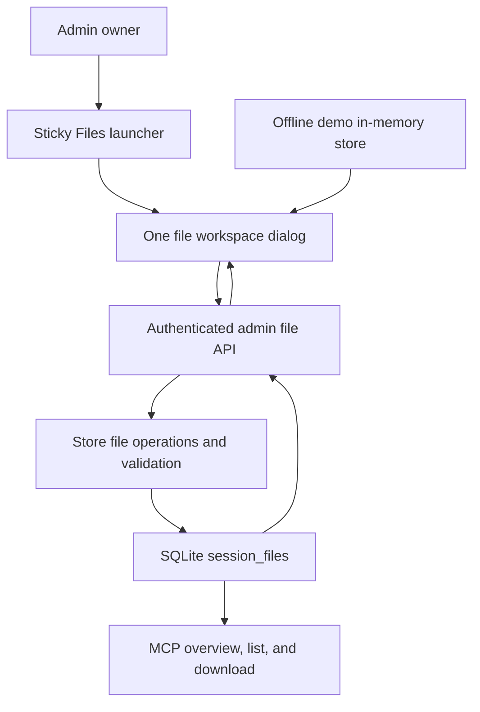
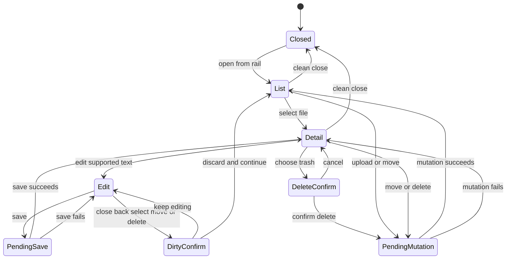
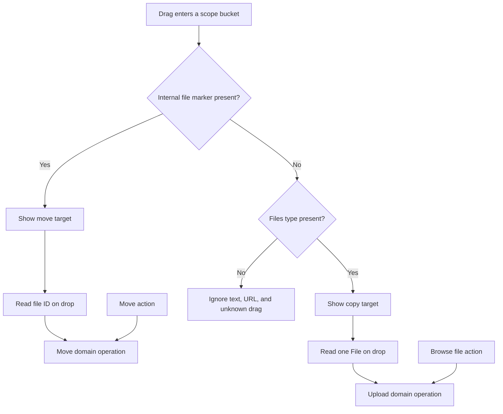

# Admin File Workspace - Plan

## Goal Capsule

| Field | Value |
|---|---|
| Objective | Replace the top-of-transcript file panel with an always-reachable admin file workspace for viewing, uploading, moving, editing, and permanently deleting session and group text files. |
| Authority | The confirmed user scope in this planning session, the current VPS repository at `main`, the shipped Session Groups and Shared Files plan, repository conventions, and the official browser, accessibility, security, and Starlette sources listed below. |
| Execution profile | Deep but bounded cross-layer feature: browser-native admin UI, admin-only HTTP mutations, SQLite file operations, MCP read compatibility, documentation, and real-browser verification. |
| Stop conditions | Stop if implementation requires binary-document support, file version history, a new frontend framework, a broad MCP mutation redesign, or changes to user-owned prototype files. |
| Tail ownership | This plan owns the complete admin workflow and the minimum server support it needs; model-side move/edit tools, recovery, bulk operations, and permanent browser-test infrastructure remain follow-up work. |

---

## Product Contract

### Summary

The admin panel will expose files through a launcher in the sticky transcript navigation rail, so the current session's files remain reachable at any scroll position.
The launcher opens one modal file workspace over the conversation with session and current-group buckets, format-forward file rows, upload affordances, preview, editing, moving, and deletion.
List, detail, editor, dirty-state confirmation, and delete confirmation are internal states of that one workspace; the feature must not open a second file overlay above it.

The work is UI-led but not UI-only.
Upload, move, edit, and delete must be real CSRF-protected admin operations backed by atomic Store methods, while existing MCP overview, list, and download tools continue to observe the same file records.

### Problem Frame

The current file panel sits above the transcript, disappears when no files exist, and expands only on hover or focus.
An owner reading near the bottom of a long conversation must scroll back to reach it, while a session with no existing files offers no discoverable upload entry point.
Opening a file then creates a separate detail dialog, which would become a nested-overlay problem if the list itself moved into an overlay without redesigning the interaction model.

The existing backend stores UTF-8 text in SQLite and exposes only create, list, and read operations.
The requested UI therefore needs bounded new mutation contracts without turning the bridge into a general file manager, binary document service, or version-control system.

### Actors

- A1. The admin owner reviews conversations and manages files in the authenticated `/admin/sessions` interface.
- A2. An authenticated model client reads the resulting file manifests and content through existing MCP overview, list, and download tools.

### Requirements

**Workspace access and composition**

- R1. A selected session exposes a Files launcher with the combined file count in the sticky transcript navigation rail at every transcript scroll position.
- R2. The Files launcher remains usable when the selected session has zero exchanges or zero files; transcript navigation controls may disable independently, and no-session state must not imply a writable target.
- R3. The launcher opens one native modal workspace whose internal panes cover the file list, preview, editor, dirty-state confirmation, and delete confirmation without nested file dialogs.
- R4. The workspace restores focus to its launcher when it closes, manages focus when internal panes change, keeps Escape and explicit close on the same dirty-aware path, and remains usable by keyboard, pointer, touch, and narrow-screen layouts.
- R5. Session files and files shared by the selected session's current group appear as separate, clearly named buckets with counts and group identity.

**Format visibility and upload**

- R6. Every file row has a prominent textual format badge such as `MD`, `TXT`, or `JSON`; color may reinforce the format but cannot be the only signal or reuse danger/group identity semantics.
- R7. An empty bucket explains that the owner can drop one supported text file or use a visible file-picker control to upload it directly into that scope.
- R8. Browser upload accepts one file at a time from the approved UTF-8 text set: `.md`, `.markdown`, `.txt`, `.json`, `.yaml`, `.yml`, `.csv`, and `.tsv`; duplicate filenames create distinct file records rather than overwriting by name.
- R9. Client preflight rejects multiple files, unsupported extensions, malformed UTF-8, empty files, and files above the existing one-million-byte content limit, while the server remains authoritative for every validation rule and request-size bound.

**Move, preview, edit, and delete**

- R10. Dragging an existing file between the two buckets and invoking its non-drag Move action call the same server operation; moving to the current scope is a harmless no-op.
- R11. A move updates the existing record atomically, preserves `file_id`, content, hash, size, creator, and creation time, and flips exactly one owner between the selected session and its current group.
- R12. Moving from session to group is described as making the file discoverable from every session in that group, while moving from group to session removes it from peer-session manifests without claiming to change authorization.
- R13. Selecting a file opens preview inside the workspace and preserves the existing safe Markdown rendering, raw-text fallback, copy action, and download action.
- R14. Supported text files can enter an in-workspace editor and save content back to the same `file_id`; saving recomputes hash and byte size and rejects empty or oversized content.
- R15. Edit requests carry the hash that was opened as an optimistic concurrency token; a stale save must not overwrite newer content, and the owner's unsaved draft remains available after a conflict or network error.
- R16. Closing, returning to the list, selecting another file, moving, or deleting an edited file cannot discard a dirty buffer without an in-workspace save/discard decision.
- R17. Every file exposes a clearly labelled red trash action whose in-workspace confirmation names the file and warns that deletion is permanent, models may still hold conversation references to it, and those models may no longer be able to find or download it.
- R18. Confirmed deletion physically removes the row and content with no restore path in this phase; cancellation changes nothing, and later reads by the deleted `file_id` return the existing unknown-file behavior.

**Security, consistency, and compatibility**

- R19. Every file mutation requires the existing admin login and CSRF header, returns no-store responses, validates the current file and target server-side, and changes the UI only after server success.
- R20. Admin and MCP manifests remain compatible: move and edit retain the same `file_id`, deletion removes the file from active manifests, and existing clients that only upload, list, and download require no tool changes.
- R21. Offline demo mode presents the same workspace states and performs upload, move, edit, and delete against its in-memory store while continuing to state that changes are not persisted.
- R22. Public documentation distinguishes manual bridge uploads from automatic external-file ingestion and states that admin mutations can change or remove model-visible file context.
- R23. User-facing strings remain English and the workspace follows the current admin visual language: neutral structure, group color for scope identity, textual format identity, and semantic red only for destructive state.

### Key Flows

- F1. Open files from anywhere in a conversation.
  - **Trigger:** A1 is reading a selected session at any transcript position.
  - **Actors:** A1.
  - **Steps:** A1 activates the rail launcher; the one file workspace opens at its list or remembered safe state and exposes both scope buckets.
  - **Outcome:** Files are reachable without transcript scrolling, including when both buckets are empty.
  - **Covered by:** R1-R5.

- F2. Upload a text artifact from the operating system.
  - **Trigger:** A1 wants to attach a local text file to the selected session or its group.
  - **Actors:** A1, admin UI, admin API, Store.
  - **Steps:** A1 drops one file on an explicit bucket or chooses it through the file picker; the browser preflights it; the server repeats authoritative validation and creates the record in the requested scope.
  - **Outcome:** The new file appears in the workspace and in existing MCP manifests for the correct scope.
  - **Covered by:** R7-R9, R19-R21.

- F3. Move a file between session and group scope.
  - **Trigger:** A1 drags a row to the opposite bucket or invokes its Move action.
  - **Actors:** A1, admin UI, admin API, Store, A2.
  - **Steps:** The UI requests the target scope by `file_id`; the server reads the current record, validates the selected session/group target, and updates that row in one transaction.
  - **Outcome:** The file keeps its identity and content while overview visibility changes for the selected and peer sessions.
  - **Covered by:** R10-R12, R19-R20.

- F4. Edit a shared text file safely.
  - **Trigger:** A1 opens a supported text file and chooses Edit.
  - **Actors:** A1, admin UI, admin API, Store, A2.
  - **Steps:** The editor keeps the opened hash, tracks a dirty buffer, submits content with that hash, and accepts the update only if the stored file is still the opened revision.
  - **Outcome:** Successful saves keep `file_id` and return new content metadata; failures preserve the draft and stored content.
  - **Covered by:** R13-R16, R19-R20.

- F5. Permanently delete a file with context warning.
  - **Trigger:** A1 invokes the red trash action.
  - **Actors:** A1, admin UI, admin API, Store, A2.
  - **Steps:** The workspace switches to an inline destructive confirmation; cancellation returns to detail; confirmation deletes the current record and refreshes both manifests.
  - **Outcome:** The file disappears from active UI and model manifests, and stale model references can no longer download it.
  - **Covered by:** R16-R20.

### Acceptance Examples

- AE1. Given a selected session and the page scrolled to its last exchange, when the owner activates the Files rail button, then the workspace opens without changing transcript scroll position and focus enters the dialog.
- AE2. Given a selected session with no exchanges and no files, when the session loads, then the Files launcher is available with count zero and both empty upload buckets are reachable.
- AE3. Given `plan.md` is valid UTF-8 and within the content limit, when it is dropped on Session files, then one new session-scoped record appears and MCP overview/list/download expose the same `file_id` and content.
- AE4. Given two files or an unsupported binary are dropped, when the UI inspects the drop, then it rejects the operation visibly and creates no records.
- AE5. Given a session file is moved to its current group, when another session in that group loads its overview, then the same `file_id` appears there while its hash and content are unchanged.
- AE6. Given a group file is moved to the selected session, when a peer session in the group reloads its overview, then the file is absent there and remains downloadable by the original `file_id`.
- AE7. Given a Markdown file is edited and saved with its current hash, when the operation succeeds, then its `file_id` and creation metadata stay stable while content, size, and hash reflect the edit.
- AE8. Given another tab changes a file after the editor opens, when the stale editor saves, then the server rejects the write, stored content stays newer, and the stale draft remains visible for recovery.
- AE9. Given an editor buffer is dirty, when the owner presses Escape, closes, returns to the list, selects another file, moves, or deletes, then the workspace asks to save or discard within the same dialog.
- AE10. Given the delete confirmation is open, when the owner cancels, then the file and current detail state remain; when the owner confirms, then the file disappears and a later admin or MCP read by that ID reports it missing.
- AE11. Given a user cannot or does not drag, when they use Browse file and Move to session/group with click, touch, or keyboard, then the outcomes match the drag flows.
- AE12. Given Markdown content contains raw HTML or a script element, when previewed, then it is rendered inert using the existing escaping path and never becomes executable DOM.
- AE13. Given a file mutation fails authentication, CSRF, validation, conflict, or network checks, when the UI receives the failure, then it preserves the current list/selection/draft and presents an actionable error.
- AE14. Given demo mode is active, when the owner uploads, moves, edits, or deletes a file, then the workspace updates its in-memory records and the demo banner continues to state that nothing is persisted.

### Success Criteria

- The file entry point is independent of transcript scroll, exchange count, and existing file count.
- All file operations complete through real Store-backed contracts, not optimistic DOM-only behavior.
- Drag flows have equivalent non-drag controls and the dialog has no nested file overlay.
- Move/edit identity and delete invalidation are visible consistently in admin and existing MCP reads.
- The complete workflow passes backend tests and real-browser keyboard, pointer, responsive, and failure-path verification without adding a frontend framework.

### Scope Boundaries

#### In Scope

- Sticky rail launcher and one modal file workspace for the selected session.
- Session/current-group lists, textual format badges, empty states, preview, copy, and download.
- Single-file UTF-8 text upload through drop and file picker.
- Same-record session/group moves through drag and a non-drag action.
- Text/Markdown editing with hash-based stale-write protection.
- Permanent file deletion with inline model-context warning.
- Minimum Store/admin API work, demo parity, MCP read compatibility, docs, tests, and live browser QA.

#### Deferred to Follow-Up Work

- Checked-in browser automation infrastructure and a browser CI job.
- Multiple-file or bulk upload, bulk move/delete, folders, search, sort controls, rename, duplicate resolution, and replace-by-filename behavior.
- Soft deletion, trash, restore, version history, diffs, audit event tables, editor collaboration, and admin activity timelines.
- Primitive MCP move and edit tools; agent-initiated deletion remains human-gated unless a separate approval and recovery design is accepted.
- Binary files, images, PDFs, DOCX, archives, media previews, antivirus scanning, document parsing, and MCP Resources exposure.
- Splitting the current browser-native admin monolith into a new frontend framework or asset pipeline.

#### Outside This Product's Identity

- Automatic ingestion of project directories or silent inclusion of every file in model context.
- Treating session/group scope as a file authorization boundary or exposing public file URLs.
- Editing, deleting, staging, or copying wholesale from the user-owned `admin-viewer-v1.html`, `admin-viewer-v2.html`, or `docs/ideation/2026-07-10-admin-visual-language-ideation.html` artifacts.

---

## Planning Contract

### Key Technical Decisions

| ID | Decision | Rationale |
|---|---|---|
| KTD1 | Replace the old panel and detail dialog with one native file-workspace `<dialog>` and internal panes. | It resolves the nested-overlay trap while retaining native modality, inert background, Escape handling, and opener focus return. |
| KTD2 | Put the launcher in the existing sticky turn rail and make rail visibility depend on a selected session, not exchange count. | The rail is already reserved for persistent transcript navigation, and zero-exchange sessions must still accept their first file. |
| KTD3 | Keep the implementation in the current `admin-viewer.html` state/render/event architecture. | The repository has no frontend build stack; introducing one would be larger than the feature, while an unrelated monolith refactor would expand risk. |
| KTD4 | Implement upload, move, edit, and delete as Store operations used by CSRF-protected admin routes. | Store-owned validation and transactions keep HTTP handlers free of direct SQL and keep admin/MCP views on the same records. |
| KTD5 | Preserve immutable `file_id` for move and edit and use existing `sha256` as the stale-edit token. | This protects model references and concurrent edits without adding revisions, history tables, or a schema migration. |
| KTD6 | Use a bounded JSON upload envelope containing base64 file bytes, then decode and validate strict UTF-8 server-side before calling the existing text-file storage path. | It avoids Starlette 1.1 multipart spooling/limit ambiguity, lets the server validate original bytes, and keeps the current JSON/CSRF helper shape. |
| KTD7 | Normalize an optional UTF-8 BOM away on browser import and save canonical UTF-8 text. | Browser and Python decoders otherwise differ on BOM handling; one canonical representation avoids invisible first-character drift. |
| KTD8 | Distinguish internal move drags from operating-system uploads through `DataTransfer.types`, but read payloads only on drop. | The drag data store is protected before drop; explicit types prevent URLs or text drags from being treated as files. |
| KTD9 | Build click/tap/keyboard upload and move operations first, then layer drag-and-drop over the same domain functions. | WCAG 2.2 requires a non-drag single-pointer alternative, and this sequence makes drag an enhancement rather than a second behavior path. |
| KTD10 | Permanently delete the active row after inline confirmation; do not add a tombstone. | The user requested an explicit warning that models may lose the file, and recovery/version history is outside scope; SQLite AUTOINCREMENT prevents ID reuse. |
| KTD11 | Keep existing MCP mutation tools unchanged and prove read-side coherence through overview, list, and download. | The feature is admin-led; new agent mutation tools would broaden scope, while existing model reads already consume the shared records. |
| KTD12 | Keep pytest API/storage coverage plus mandatory real-browser QA, but do not add a tracked browser harness in this phase. | Interaction risk needs browser proof, yet introducing Node/Playwright CI infrastructure is a separate tooling decision in this Python/vanilla-JS repo. |

### High-Level Technical Design

#### Component and context flow

#### Workspace state model

#### Drag dispatch and accessible convergence

### Implementation Constraints

- `admin-viewer.html` remains browser-native and self-contained; use the existing central `state`, cached `dom`, `render*`, `api`, `setStatus`, and demo adapter patterns.
- File names, MIME values, badges, and content enter the DOM through text-safe paths; the existing Markdown renderer may remain only because it escapes source before applying its limited markup.
- Do not use the current global `setBusy()` to trap the whole dialog during long file operations; track pending state inside the workspace and disable only conflicting controls.
- The server, never a drag payload or browser MIME value, resolves current scope, validates the selected session/current group, and decides the mutation.
- File content stays non-empty and at or below `MAX_SESSION_FILE_BYTES`; the bounded request envelope accounts for base64 expansion and metadata before JSON parsing.
- The admin upload allowlist is extension-led and server-owned; MIME is stored metadata and a hint, not the security decision.
- The three untracked visual-language artifacts named in Scope Boundaries are read-only provenance and must remain untouched.

### Assumptions

- File scope means manifest discoverability, not authorization; an authenticated client with a valid `file_id` can still download a moved file.
- The group target is always the selected session's current group, and the session target is always the selected session.
- One file per upload is sufficient for this phase; multi-file selection or drop is rejected as a whole.
- Permanent deletion with no restore is intentional and is accepted through the requested destructive confirmation.
- Existing files outside the admin upload allowlist remain readable; content editing is offered only when the server classifies the stored filename as a supported text type.

### Sequencing

1. Establish Store mutation, identity, validation, and stale-write contracts with tests.
2. Expose bounded CSRF-protected admin mutation routes and integration coverage.
3. Replace the old panel/dialog with the rail launcher, one accessible workspace, and in-workspace preview.
4. Add ordinary upload and move controls with their demo behavior, then layer internal and external drag over those proven operations.
5. Add editing, dirty guards, deletion, and their demo parity after upload and move are stable.
6. Finish model-context documentation, real-browser QA, full regression checks, and cleanup.

### System-Wide Impact

- **Storage:** `session_files` gains update, move, and delete behavior but no new table or lifecycle column; edit recalculates current hash/size and hard delete removes content.
- **Admin API:** A previously read-only file route family gains bounded authenticated mutations with the same CSRF and no-store posture as session/exchange changes.
- **Admin UI:** The top panel and standalone file-detail dialog are retired, the rail persists for a selected empty session, and demo mode gains mutable file records.
- **Model context:** Move changes which overview manifests surface a file, edit changes content behind a stable ID, and delete invalidates stale references without adding transcript events or notifications.
- **Accessibility:** Drag is secondary to file-picker and Move controls; the modal owns focus, dirty-state protection, and responsive single-pane behavior.
- **Documentation:** Public wording must no longer imply that only MCP tools can upload bridge files, while preserving the boundary that ingestion is explicit rather than automatic.

### Risks and Mitigations

| Risk | Impact | Mitigation |
|---|---|---|
| File-workspace state bloats the 2,799-line HTML monolith. | Interactions become hard to reason about and regress unrelated chat UI. | Keep file state/render/event helpers in one contiguous section, reuse current patterns, avoid unrelated refactors, and verify the three transcript layouts. |
| Native dialog transitions lose focus or discard dirty edits. | Keyboard users become trapped or content is lost. | Centralize close/navigation guards, restore origin focus per pane, focus the least destructive confirmation action, and test Escape plus Tab/Shift+Tab. |
| Internal and OS drags are confused. | A move becomes an upload, unknown dragged content is accepted, or DOM state diverges from storage. | Classify only by known `DataTransfer.types`, read payload on drop, ignore unknown drags, and render results only after the shared server operation succeeds. |
| Browser validation is bypassed or Starlette buffers an oversized body. | Invalid content or memory pressure reaches the app. | Use a bounded streaming JSON reader before parsing, base64 validation, strict UTF-8 decode, extension allowlist, and the existing stored-content byte limit. |
| Two tabs edit the same file. | A stale buffer silently overwrites newer model context. | Require the opened SHA-256 on edit and return a conflict without replacing content or clearing the local draft. |
| Moving a group file changes broad visibility. | The owner may unintentionally hide it from or expose it to peer sessions. | Label both buckets with reach semantics, keep Move available without drag, and confirm success with refreshed manifests. |
| Permanent delete leaves transcript references stale. | A model may fail to retrieve a file mentioned earlier. | Name that consequence in the inline destructive confirmation and document current manifests as authoritative. |
| No checked-in browser harness exists. | DOM interaction regressions are not covered by CI. | Require live browser verification for focus, drag classification, errors, dirty state, responsive layouts, and console cleanliness; defer harness adoption explicitly. |

### Sources and Research

- `docs/plans/2026-06-28-001-feat-session-groups-files-plan.md` records the shipped session/group file product contract and its explicit text-file boundary.
- `admin-viewer.html` contains the current sticky turn rail, hover-expanded top file panel, standalone file dialog, state/render helpers, safe Markdown path, and offline demo adapter.
- `app/storage.py`, `app/admin.py`, and `app/main.py` define the SQLite file record, validation, current GET route, admin auth/CSRF pattern, and MCP upload/list/download surfaces.
- `tests/test_admin.py` and `tests/test_sessions.py` establish current admin API, CSRF, Store, group reassignment, and MCP file test patterns.
- [WHATWG dialog element](https://html.spec.whatwg.org/multipage/interactive-elements.html#the-dialog-element), [WAI modal dialog pattern](https://www.w3.org/WAI/ARIA/apg/patterns/dialog-modal/), and [WCAG H102](https://www.w3.org/WAI/WCAG22/Techniques/html/H102) shape the one-dialog, cancel, focus, and scroll decisions.
- [WHATWG drag and drop](https://html.spec.whatwg.org/multipage/dnd.html) defines protected drag data, custom types, `Files`, and copy/move feedback.
- [WCAG 2.2 Dragging Movements](https://www.w3.org/WAI/WCAG22/Understanding/dragging-movements), [Use of Color](https://www.w3.org/WAI/WCAG22/Understanding/use-of-color), [Target Size](https://www.w3.org/WAI/WCAG22/Understanding/target-size-minimum), and [Focus Visible](https://www.w3.org/WAI/WCAG22/Understanding/focus-visible) require non-drag actions and perceivable controls.
- [W3C File API](https://www.w3.org/TR/FileAPI/#text-method-algo) and the [WHATWG Encoding Standard](https://encoding.spec.whatwg.org/#interface-textdecoder) establish strict client decoding and MIME limitations.
- [OWASP File Upload](https://cheatsheetseries.owasp.org/cheatsheets/File_Upload_Cheat_Sheet.html), [Authorization](https://cheatsheetseries.owasp.org/cheatsheets/Authorization_Cheat_Sheet.html), [CSRF](https://cheatsheetseries.owasp.org/cheatsheets/Cross-Site_Request_Forgery_Prevention_Cheat_Sheet.html), and [XSS Prevention](https://cheatsheetseries.owasp.org/cheatsheets/Cross_Site_Scripting_Prevention_Cheat_Sheet.html) shape server authority, allowlisting, request protection, and safe rendering.
- [Starlette 1.1.0 request source](https://github.com/Kludex/starlette/blob/1.1.0/starlette/requests.py) shows that JSON bodies are buffered without an application size limit, making bounded parsing load-bearing.

### Deferred Implementation Notes

- Exact dialog dimensions, spacing, format colors, and the narrow-screen breakpoint should be tuned against the current visual language in a real browser rather than fixed in the plan.
- Exact helper names and the fixed JSON-envelope overhead constant remain implementation details; the bounded-before-parse and one-million-byte stored-content outcomes are authoritative.
- If browser QA reveals that a contiguous file-workspace section is no longer reviewable inside `admin-viewer.html`, stop and propose a separate asset-loading plan instead of silently adding a frontend architecture.

---

## Implementation Units

### U1. Establish Store File Mutation Contracts

**Goal:** Add atomic update, move, delete, validation, and shared payload behavior around the existing `session_files` rows without changing file identity or adding lifecycle storage.

**Requirements:** R8-R12, R14-R15, R18-R20.

**Dependencies:** None.

**Files:** `app/storage.py`, `tests/test_sessions.py`.

**Approach:** Extend the Store boundary with one-row content update guarded by expected SHA-256, one-row scope move that derives and validates the current/target owners, and permanent delete.
Reuse existing filename/content/MIME validation, session existence checks, active-group checks, locking, and transactions.
Centralize file-record serialization so Store lists and admin/MCP payloads cannot drift, while preserving all existing response keys.

**Execution note:** Start with failing Store and MCP-read compatibility tests for identity, atomicity, conflict, and deletion.

**Patterns to follow:** Existing file save/get/list methods and the in-place group-file reassignment inside group deletion in `app/storage.py`; current pytest Store setup in `tests/test_sessions.py`.

**Test scenarios:**

1. Move a session file to its session's active group and assert the same ID, content, hash, size, creator, and creation time with mutually exclusive owner columns.
2. Move that group file to a valid session and assert it leaves peer-session manifests while remaining downloadable by the same ID.
3. Reject unknown sessions, inactive/unknown groups, invalid target scopes, mixed owner targets, and moves of missing IDs without partial updates.
4. Treat a move to the current scope as idempotent and preserve all metadata.
5. Edit with the current SHA-256 and assert ID/creation metadata stability plus recomputed content, hash, and byte size.
6. Reject stale SHA-256, empty content, and content above `MAX_SESSION_FILE_BYTES` without changing the stored row.
7. Permanently delete one file, omit it from all active lists/overviews, and return no record for its old ID while a later insert receives a different ID.
8. Preserve existing MCP upload/list/download behavior and payload keys for clients unaware of admin mutations.

**Verification:** Store methods express every invariant in one transaction, and focused session tests prove model-facing reads remain coherent.

### U2. Add Bounded Admin File Mutation Routes

**Goal:** Expose upload, single-operation edit/move, and delete contracts through the authenticated admin API without allowing unbounded request buffering.

**Requirements:** R8-R12, R14-R20.

**Dependencies:** U1.

**Files:** `app/admin.py`, `app/main.py`, `tests/test_admin.py`.

**Approach:** Add an admin collection upload route and extend the per-file route family for exactly one edit or move operation per request plus deletion.
Require admin authentication and CSRF for every mutation, keep no-store headers, resolve selected session/current group server-side, and translate validation/not-found/conflict failures consistently.
Read file mutation JSON through a byte-counting stream helper before parsing; browser uploads carry one base64 payload, which the server validates, strictly decodes as UTF-8 with optional BOM normalization, and passes to the existing Store save path.

**Execution note:** Prove each HTTP contract through failing TestClient tests before wiring the browser UI.

**Patterns to follow:** `_require_admin_mutation`, `_json_body` error style, `_value_error`, existing session/group mutation responses, and current file payloads in `app/admin.py` and `app/main.py`.

**Test scenarios:**

1. Reject unauthenticated upload/edit/move/delete and authenticated mutations without the current CSRF token.
2. Upload one valid allowlisted file to a session and to its current group, then assert correct scope, canonical MIME, content, hash, size, creator, and manifest visibility.
3. Reject invalid base64, malformed UTF-8, optional-BOM edge cases outside the chosen normalization, unsupported extensions, empty content, multiple-file-shaped payloads, and decoded content above the limit.
4. Reject a request whose envelope exceeds its bound even when Content-Length is absent or misleading, and store no partial file.
5. Edit with the current hash and return the same ID plus new metadata; reject a stale hash as a conflict without returning file content unnecessarily.
6. Move to each valid target, no-op on the current target, and reject arbitrary group/session targets outside the selected-session contract.
7. Delete an existing file, return not-found on repeat/delete/read, and keep unrelated files untouched.
8. Reject mixed edit-and-move payloads so one request cannot perform two ambiguous operations.
9. Confirm GET file and existing MCP payload shapes remain backward compatible after additive route work.

**Verification:** Admin tests prove auth, CSRF, request bounds, validation, status mapping, identity, and cross-surface manifest behavior before UI integration.

### U3. Build the Rail Launcher and Single Workspace Shell

**Goal:** Retire the top file panel and standalone detail dialog in favor of an always-reachable launcher and one accessible, responsive workspace.

**Requirements:** R1-R7, R13, R23.

**Dependencies:** U2.

**Files:** `admin-viewer.html`, `tests/test_admin.py`.

**Approach:** Add the Files launcher and count to the existing sticky turn rail, decouple rail visibility from exchange count, and disable transcript arrows independently when there are no turns.
Replace `#filesPanel` and `#fileDialog` with one dialog containing session/group lists and an internal detail area that retains preview/copy/download behavior.
On narrow screens, switch from simultaneous list/detail regions to a single-pane back-navigation model without creating another modal.

**Execution note:** Preserve the current HTML contract tests, then prove focus, scroll, and responsive behavior in a live browser before adding mutations.

**Patterns to follow:** Existing `.turn-nav`, native group/file dialogs, central state/DOM caches, `renderFiles`, safe preview renderer, group identity treatment, and responsive/reduced-motion CSS in `admin-viewer.html`.

**Test scenarios:**

1. Covers AE1. Open the workspace from the top, middle, and bottom of a long transcript and assert transcript scroll does not jump.
2. Covers AE2. Select a zero-exchange/zero-file session and assert the rail shows Files count zero, both empty buckets, and disabled transcript arrows.
3. Open and close by mouse, keyboard, Escape, and explicit close; assert focus enters a meaningful control and returns to the Files launcher.
4. Select files in each bucket and assert preview, raw/Markdown rendering, metadata, copy, and download stay inside the same dialog.
5. Render filenames, MIME values, and Markdown containing HTML/script and assert no untrusted value executes or enters unsafe markup paths.
6. Verify textual format badges, visible focus, target sizes, group-vs-danger color separation, and reduced-motion behavior.
7. At desktop, 920px-adjacent, and phone widths, assert list/detail navigation remains usable without background scroll or clipped actions.

**Verification:** The old panel/detail modal are absent, one file dialog owns all views, and live browser inspection shows no focus loss, nested overlay, scroll jump, or console error.

### U4. Add Accessible Upload and Scope Movement

**Goal:** Implement file-picker and Move controls first, then layer operating-system upload and internal move drag-and-drop over those same operations.

**Requirements:** R6-R12, R19-R21, R23.

**Dependencies:** U3.

**Files:** `admin-viewer.html`, `tests/test_admin.py`.

**Approach:** Give both buckets a visible one-file picker/drop zone and every row a non-drag Move action.
Use strict `TextDecoder` client preflight before encoding upload bytes, keep client errors local, and refresh selected file/counts only after the server creates or moves the record.
Internal drags advertise a private type and move effect; OS file drags advertise `Files` and copy effect; unknown text/URL drags never become drop targets.
Make demo upload/move mutate the same in-memory file objects and IDs used by demo reads.

**Execution note:** Finish and browser-test the ordinary controls before enabling draggable rows and drop listeners.

**Patterns to follow:** Existing `api` CSRF behavior, `mutate` reload/status pattern adapted to workspace-local pending state, demo API/store adapter, and text-safe DOM builders.

**Test scenarios:**

1. Covers AE3. Upload a valid file through the picker and OS drop into each scope and assert identical server/UI/MCP outcomes.
2. Covers AE4. Reject multiple files, unsupported/binary files, invalid UTF-8, empty files, oversized files, text drags, URL drags, and malformed internal payloads without changing UI or storage.
3. Covers AE5. Move session to group by button and drag, preserve identity/content, and expose it in a peer session's group manifest.
4. Covers AE6. Move group to session by button and drag, preserve identity/content, and remove it from peer-session manifests.
5. Drop or move to the current scope and show a no-op status without a duplicate request or record.
6. Simulate network/validation failures and assert the source row stays in place, the drop highlight clears, focus remains usable, and retry is possible.
7. Covers AE11. Complete upload and move using click/touch/keyboard without any drag gesture.
8. Covers AE14. Repeat create and move in demo mode and assert its banner remains truthful and its in-memory manifests refresh.

**Verification:** Button and drag flows converge on one upload/move path, server results drive rendering, and all non-drag alternatives work in a real browser.

### U5. Add Editing, Dirty Guards, and Destructive Deletion

**Goal:** Complete the workspace state machine with same-ID editing, stale-write handling, unsaved-change protection, and permanent delete confirmation.

**Requirements:** R3-R4, R13-R21, R23.

**Dependencies:** U4.

**Files:** `admin-viewer.html`, `tests/test_admin.py`.

**Approach:** Add preview/edit switching for server-classified text files, track baseline content/hash and dirty state, and submit the opened hash with edits.
Route close, Escape, list return, file selection, move, and delete through one guard that swaps the current pane to save/discard confirmation without opening another dialog.
Render the red trash action with an accessible name, switch to an inline destructive confirmation with the model-context warning, and refresh only after confirmed server deletion.
Make demo edit/delete follow the same state transitions.

**Execution note:** Verify buffer preservation and focus transitions after every failure path, not only successful save/delete.

**Patterns to follow:** Existing exchange edit form, status/error handling, file preview/copy/download helpers, and native dialog close events in `admin-viewer.html`.

**Test scenarios:**

1. Covers AE7. Edit and save Markdown/plain/structured text and assert same ID, new content/hash/size, safe preview, and MCP download coherence.
2. Covers AE8. Cause a hash conflict from a second client and assert newer stored content survives while the first editor retains its draft and gets reload/copy guidance.
3. Reject empty or oversized edits and keep the editor dirty with its input intact.
4. Covers AE9. Exercise close, Escape, Back, another selection, move, and delete with a dirty buffer; choose keep editing, save, and discard and assert each transition/focus result.
5. Covers AE10. Cancel deletion and preserve detail/selection; confirm deletion and assert the row/count/detail/manifests clear and later reads return missing.
6. Assert the confirmation names the target and communicates permanence, no recovery, and the risk to model-held conversation references.
7. Fail save/delete over network, auth, CSRF, conflict, and not-found paths and assert no optimistic list mutation or lost draft.
8. Repeat edit, dirty discard, cancel delete, and confirmed delete in demo mode.

**Verification:** One dialog covers every edit/delete state, no navigation loses a dirty buffer silently, and permanent deletion has an explicit accessible warning and coherent model-visible result.

### U6. Align Documentation and Run Cross-Surface Verification

**Goal:** Document explicit admin file management and mutable model context, then verify the complete feature without widening the public tool surface.

**Requirements:** R20-R22.

**Dependencies:** U1-U5.

**Files:** `README.md`, `CHANGELOG.md`, `docs/limitations.md`, `docs/model-instructions.md`, `docs/project-prompt-template.md`, `tests/test_sessions.py`, `tests/test_admin.py`.

**Approach:** Update public wording so files may be explicitly uploaded through admin UI or MCP tools, while the bridge still never ingests directories or injects files automatically.
State that current overview/list manifests are authoritative after owner moves, edits, or deletes, and preserve the existing instruction to download relevant files deliberately.
Run targeted, full, demo, and live-browser gates against tracked files only.

**Patterns to follow:** Current concise README tool-flow language, hard-stop model instructions, prompt-template tests, CONTRIBUTING requirements, and recent CHANGELOG entries.

**Test scenarios:**

1. Assert docs no longer claim that MCP tools are the only upload path and do not imply automatic external-file ingestion.
2. Assert model instructions keep overview/list/download as the current-state reconciliation path and do not promise automatic mutation notifications.
3. Assert no new public MCP move/edit/delete tools appear, while existing tool names and payloads remain unchanged.
4. Exercise the complete live admin flow with two sessions in one group and verify UI/API/MCP state after upload, both move directions, edit, conflict, cancel delete, and confirmed delete.
5. Verify all three transcript layouts, zero-exchange state, demo mode, responsive widths, keyboard-only operation, reduced motion, and browser console cleanliness.
6. Inspect the final diff and assert user-owned untracked prototype/ideation artifacts remain untouched and no abandoned experiment code remains.

**Verification:** Documentation, tests, and live behavior describe one coherent explicit file workspace without adding automatic ingestion or broad model mutations.

---

## Verification Contract

| Gate | Applies to | Required outcome |
|---|---|---|
| Targeted backend tests: `uv run pytest tests/test_sessions.py tests/test_admin.py` | U1-U6 | Store invariants, auth/CSRF, request bounds, admin mutations, MCP read compatibility, and HTML contracts pass. |
| Full regression suite: `uv run pytest` | U1-U6 | All repository tests pass on the VPS with no regression in OAuth, sessions, prompts, security, or onboarding. |
| Demo smoke: `uv run python scripts/demo_session.py` | U6 | Existing core session demo remains successful after file contract changes. |
| Real-browser admin QA against a live VPS process | U3-U6 | Pointer, keyboard, touch-sized controls, focus return, Escape/dirty guards, picker, both drag classes, failures, responsive layouts, reduced motion, and console state match the Acceptance Examples. |
| Cross-surface data check | U1-U6 | Each UI mutation produces the expected current admin session payload and MCP overview/list/download result using stable IDs where required. |
| Repository hygiene review | U6 | Only intended tracked files changed; untracked prototypes/ideation and runtime database/secrets remain untouched; no experimental dead code is left behind. |

---

## Definition of Done

- The file workspace is reachable from the sticky rail for every selected session, including empty sessions and zero-file state.
- Exactly one file dialog exists, with list, preview, edit, dirty-confirm, and delete-confirm states inside it.
- Upload and move work through both drag and non-drag paths and render only server-confirmed outcomes.
- Move/edit preserve `file_id`; stale edit is rejected; delete is permanent and explicitly warns about model-context breakage.
- Admin and existing MCP reads agree after every mutation without adding new public mutation tools.
- Security boundaries cover login, CSRF, target validation, bounded request parsing, strict text decoding, extension allowlisting, and safe rendering.
- Demo mode, docs, targeted tests, full tests, and real-browser scenarios are complete.
- The implementation preserves current chat layouts and visual language, touches no user-owned untracked artifacts, and removes all abandoned or duplicate code from unsuccessful approaches.

| Unit | Done signal |
|---|---|
| U1 | Store tests prove atomic same-ID move/edit, conflict rejection, hard delete, and MCP read compatibility. |
| U2 | Admin integration tests prove bounded authenticated upload/edit/move/delete with consistent errors and no partial writes. |
| U3 | The old top panel/detail modal are replaced by one accessible rail-launched workspace across empty, long, and responsive sessions. |
| U4 | Picker/button flows and both drag sources converge on the same server-confirmed upload/move behavior, including demo mode. |
| U5 | Editing, dirty guards, conflict recovery, and inline permanent-delete warning preserve focus and user data on every failure path. |
| U6 | Public docs, all automated tests, live browser QA, cross-surface checks, and repository hygiene gates are satisfied. |
