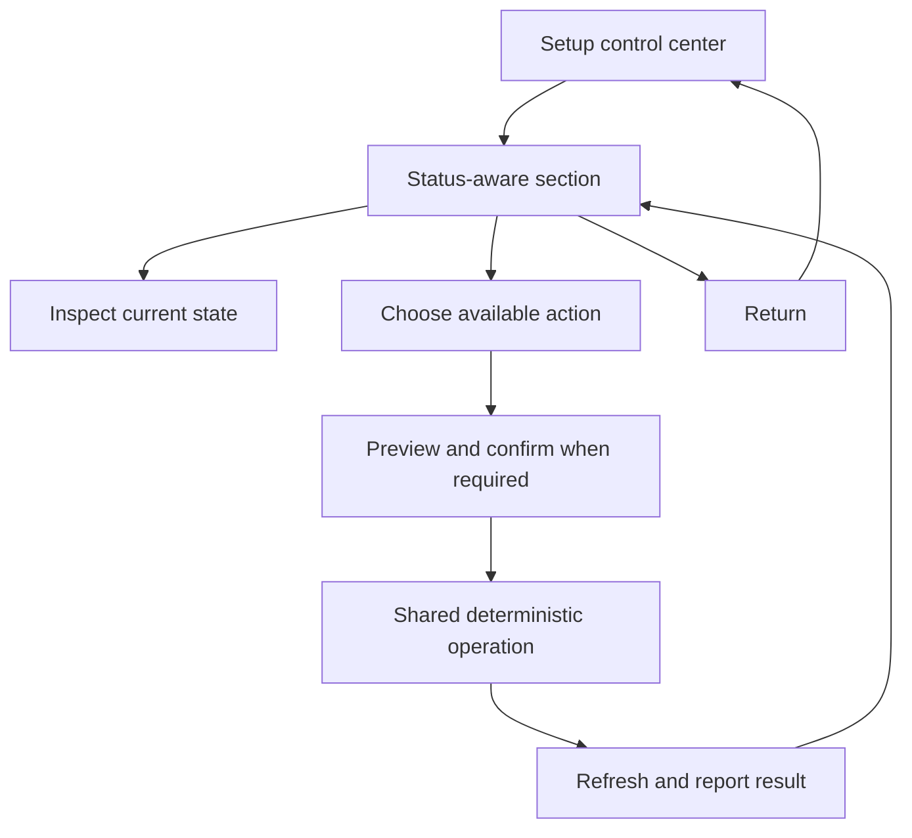
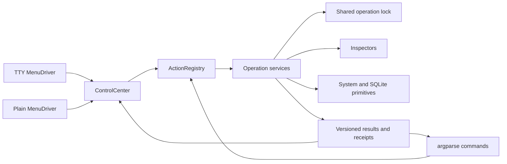
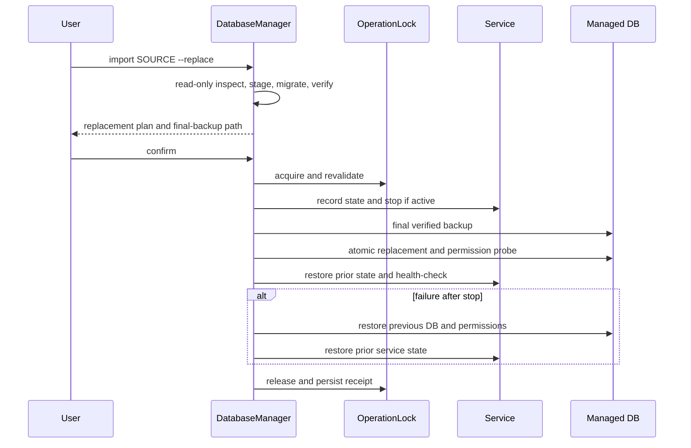

# Terminal Setup Control Center - Plan

## Goal Capsule

- **Objective:** Turn `mcp-bridge setup` into a resumable terminal control center that exposes live state, safe actions, database portability, full installation, verification, and scoped uninstall.
- **Product authority:** The control center is the human-facing view over the same deterministic operations available through direct CLI commands.
- **Open blockers:** None.
- **Execution authority:** Implement on `codex/bridge-cli-v1` without deploying, restarting the live service, pushing, or deleting the existing installation.
- **Stop condition:** Code, tests, and documentation are complete; destructive VPS acceptance remains an explicit later user-run step.

---

## Product Contract

### Summary

`mcp-bridge setup` will provide arrow-key navigation, status-aware sections, and complete submenus for installation and daily operations.
The conversation database will be a portable asset that can be verified, backed up, imported by replacement, and exported before uninstalling the rest of Bridge.

### Problem Frame

The current setup wizard is a numbered linear flow that recommends the next incomplete step but gives limited visibility into what each section owns or what can be safely repeated.
Users can complete installation, yet they cannot use the same surface to inspect, repair, back up, replace, or remove individual parts with confidence.
The managed Linux layout is operationally sound, but distributed system paths create anxiety unless one command can account for every owned file and preserve the only irreplaceable asset: the conversation database.

### Key Decisions

- **Keep the managed Linux filesystem layout.** (session-settled: user-approved — chosen over consolidating the application into one folder: a scoped uninstaller provides removability without abandoning standard service, configuration, release, and data locations.) Governs R16.
- **Replace the complete database on import.** (session-settled: user-directed — chosen over merging sessions or restricting import to empty installations: replacement is predictable when the current database is automatically backed up and recoverable.) Governs R8, R9.
- **Use a nested terminal control center.** (session-settled: user-directed — chosen over the flat numbered wizard: every section should expose state, details, available actions, and Return.) Governs R1, R2, R3.
- **Treat configuration as disposable and the SQLite database as portable.** (session-settled: user-directed — chosen over restoring the whole installation: conversations are the only required continuity asset.) Governs R6, R7, R13, R15.
- **Keep menu actions and direct commands equivalent.** Governs R4 so automation and interactive use share behavior.

### Requirements

**Navigation and presentation**

- R1. Interactive setup supports Up and Down navigation, Enter selection, Escape or `q` return, and clean Ctrl+C cancellation on a TTY.
- R2. Cursor position is visually distinct from section health, using stable states for healthy, attention, incomplete, working, and failed.
- R3. Every section shows a concise purpose, current status, relevant details, available actions, disabled-action reasons, and a final Return action.
- R4. Every interactive action invokes the same operation available through a deterministic direct CLI command.
- R5. After an action, setup refreshes live state and reports what changed, whether it worked, and the next available action without losing the user's menu position.

**Database portability and safety**

- R6. Database status shows path, size, session count, schema, integrity, WAL availability, ownership, creation time, latest conversation time, and last verification time when available.
- R7. Database backup creates a standalone SQLite copy through the SQLite backup mechanism, verifies integrity, reports the destination, and excludes configuration and context packs by default.
- R8. Database import accepts a compatible Bridge or legacy SQLite database, inspects it before confirmation, and warns that the complete current database will be replaced.
- R9. Import automatically backs up the current database, prepares and migrates the source copy, performs a quiesced atomic replacement, verifies writable WAL access and service health, and restores the previous database on failure.
- R10. Database operations include Verify, Import, Backup, Schema Migration, Optimize, and Reset to Empty; destructive variants require a separate warning and confirmation.
- R11. Reset to Empty exports and verifies the current database before creating a new database unless the user enters the separate permanent-erasure flow.

**Control-center sections**

- R12. The main menu contains Server Readiness, Existing Installation, Bridge Files, Database, Administrator, Public Address, Background Service, Run Full Installation, Verify Installation, and Exit.
- R13. Section submenus expose the approved inspect, verify, configure, install, repair, update, service-control, log, and return actions appropriate to their live state.
- R14. Run Full Installation computes a plan from current state, changes only required sections by default, previews consequences, preserves or imports conversations, and ends with a result summary.
- R15. Verify Installation offers standard checks, deep diagnostics, the last persisted report, and diagnostic export; results remain visible until the user returns.

**Installation ownership and removal**

- R16. Bridge continues to use the managed Linux separation of release files, configuration, mutable data, service definitions, reverse-proxy configuration, and global CLI registration.
- R17. Uninstall offers dry-run preview and independently scoped removal of the service, releases, configuration, CLI, operational state, Caddy integration, backups, and database.
- R18. The recommended uninstall exports and verifies the database outside Bridge-owned paths before removing the installed database and leaves unrelated Caddy configuration and host services untouched.
- R19. Permanent database removal is never preselected and requires an explicit destructive confirmation distinct from ordinary uninstall.

**Compatibility and recovery**

- R20. Existing resumable setup receipts, operation locking, staged activation, automatic backups, health checks, and rollback guarantees remain effective behind the new menus.
- R21. Non-interactive environments retain direct commands and machine-readable output without depending on arrow-key rendering.
- R22. Disabled or cancelled menu actions make no state changes, and an interrupted multi-step operation either completes its verified boundary or restores the previous state.
- R23. Database portability preserves sessions, groups, files, OAuth/application rows, and settings stored in SQLite, while clearly warning that a fresh `BRIDGE_SECRET_KEY` invalidates old OAuth credentials and encrypted provider keys; users must reconnect harnesses and re-enter provider keys after a DB-only restore.

### Interaction Structure



### Key Flows

- F1. Control-center navigation
  - **Trigger:** The user runs interactive setup in a TTY.
  - **Steps:** Setup inspects all sections, displays the main menu, opens the selected submenu, preserves selection after actions, and returns without mutation when requested.
  - **Outcome:** The user can explore the complete installation without committing to a change.
  - **Covers:** R1-R5, R12-R13, R21-R22.
- F2. Database replacement import
  - **Trigger:** The user selects Import and provides a SQLite source.
  - **Steps:** Setup inspects the source and destination, states that replacement will occur, receives confirmation, backs up the destination, replaces it through the safe cutover, and verifies the result.
  - **Outcome:** The imported sessions become authoritative, or the previous database is restored.
  - **Covers:** R6, R8-R9, R20, R22.
- F3. Portable database backup
  - **Trigger:** The user selects Backup or uninstall requires database preservation.
  - **Steps:** Bridge creates an online SQLite copy, verifies it, records useful metadata, and reports a path outside removable installation state.
  - **Outcome:** The conversation database can be moved into a fresh installation without configuration continuity.
  - **Covers:** R7, R18.
- F4. Full installation
  - **Trigger:** The user selects Run Full Installation.
  - **Steps:** Setup derives required work from live state, previews the plan, executes only confirmed changes, activates once prerequisites are ready, and reports verification.
  - **Outcome:** A fresh or partial installation reaches a healthy managed state without blindly overwriting healthy sections.
  - **Covers:** R14, R20, R22.
- F5. Scoped uninstall
  - **Trigger:** The user opens Uninstall from Existing Installation.
  - **Steps:** Setup displays owned components, preselects database export, previews removal, verifies the export, removes only selected Bridge components, and reports what remains.
  - **Outcome:** Bridge can be removed predictably while conversations remain portable.
  - **Covers:** R17-R19, R22.
- F6. Operational verification
  - **Trigger:** The user selects standard or deep verification.
  - **Steps:** Setup runs the selected checks, persists the report, displays all results until acknowledgment, and provides remediation for failures.
  - **Outcome:** The user knows current health and the next corrective action.
  - **Covers:** R5, R15.

### Acceptance Examples

- AE1. **Covers R1-R5.** Given a healthy installation, when the user enters Database and returns without selecting an operation, then no files or services change and the cursor returns to Database in the refreshed main menu.
- AE2. **Covers R8-R9.** Given a healthy current database and a valid backup with different sessions, when import is confirmed, then the UI states that replacement will occur, preserves a verified backup, activates the imported sessions, and reports the new count.
- AE3. **Covers R8-R9, R22.** Given a corrupt or incompatible source database, when import preflight runs, then replacement is unavailable, the reason is displayed, and the current service and database remain unchanged.
- AE4. **Covers R9, R20, R22.** Given a valid import that fails its post-swap health check, when rollback completes, then the previous database and service return and the failure report identifies the unsuccessful stage.
- AE5. **Covers R17-R19.** Given a managed installation with conversations, when recommended uninstall runs, then a verified portable database remains outside Bridge-owned paths while the selected application components are removed.
- AE6. **Covers R14.** Given a partially configured installation, when full installation is previewed, then healthy sections show no action and only incomplete or explicitly selected repair work is proposed.
- AE7. **Covers R15.** Given verification completes, when results are displayed, then the menu does not immediately redraw over them and waits for Return or acknowledgment.
- AE8. **Covers R21.** Given no interactive TTY, when a direct database or service command runs, then it completes without requiring arrow-key input and can return structured output where supported.
- AE9. **Covers R23.** Given a database imported into an installation with a different secret key, when import finishes, then sessions and uploaded files remain present and the result explicitly instructs the user to reconnect harnesses and re-enter encrypted provider keys.

### Success Criteria

- A new user can inspect every setup section and return without making a change.
- A real Bridge database can be backed up, removed from the managed installation, imported into a fresh installation, and verified with its sessions intact.
- Re-running setup on a healthy installation provides useful management actions instead of forcing the installation sequence.
- Ordinary uninstall preserves conversations by default and reports every removed and retained component.
- Existing activation, update, rollback, and status tests remain green alongside new navigation and database lifecycle coverage.

### Scope Boundaries

- Database merge semantics are excluded from the first version; import replaces the complete database.
- Connector and harness configuration is excluded.
- Context packs are not included in the default portable database backup.
- Native Windows, native macOS, and Docker installation backends are excluded.
- Collapsing managed Linux files into a single folder is excluded.
- Automatic publication of releases and the final update-discovery endpoint are separate release-management work.

### Dependencies and Assumptions

- The interactive control center runs on the currently supported Debian or Ubuntu VPS with a real TTY.
- SQLite remains the conversation source of truth and contains its schema version.
- The service can tolerate a brief stop during final database replacement.
- Existing online backup, migration, writable probe, health-check, operation-lock, and rollback primitives remain reusable.

### Outstanding Questions

None block implementation. Diagnostic export begins as versioned, secret-free JSON; archive/log export can be added later as an explicit sensitive-data option.

### Sources and Research

- `bridge_cli/setup_wizard.py` — current flat wizard, state inspection, recommendation, and resumable setup behavior.
- `bridge_cli/install.py` — staging, activation, SQLite cutover, service verification, and rollback guarantees.
- `bridge_cli/system_files.py` and `bridge_cli/database_probe.py` — SQLite backup, sidecar cleanup, and writable WAL checks.
- `bridge_cli/release.py` — operation lock, update backup, and rollback patterns.
- Installed OpenClaw CLI documentation and runtime were inspected as a behavioral reference for arrow navigation, scoped uninstall, dry-run, and portable backup.
- [prompt-toolkit documentation](https://python-prompt-toolkit.readthedocs.io/en/stable/pages/asking_for_input.html) — custom key bindings, terminal-safe prompts, and testable input/output.

---

## Planning Contract

### Key Technical Decisions

- **KTD1 — One operation registry is the source of truth.** Each action is an `ActionSpec` with stable ID, section, risk, availability, plan/execute functions, and direct CLI mapping. TUI contains no installation logic. Both surfaces return a versioned `OperationResult` with state, changes, checks, artifacts, rollback state, and next actions.
- **KTD2 — Use `prompt-toolkit>=3,<4` behind a small `MenuDriver`.** The TTY driver owns arrows, Enter, Escape, `q`, Ctrl+C, disabled actions, and terminal restoration. A numbered plain driver uses the same controller for `TERM=dumb`; non-TTY users receive direct-command guidance rather than an interactive wait.
- **KTD3 — Lock each mutation, never the browsing session.** Move the shared lock out of `UpdateManager`. Inspect and navigation remain unlocked. Mutations acquire one non-nested lock immediately before execution and revalidate state inside it.
- **KTD4 — Database replacement is staged and transactional.** The source is opened read-only, copied to staging on the destination filesystem, inspected, migrated only in staging, verified, then atomically swapped after a final stopped-service backup. Any post-stop failure restores database, permissions, and original service state.
- **KTD5 — Persist append-only operation receipts separately from update rollback authority.** Receipts record phases, artifacts, checks, service state, and rollback. The last successful release update retains its own durable receipt so unrelated database operations cannot remove rollback eligibility.
- **KTD6 — Uninstall is manifest- and provenance-driven.** Remove exact owned paths only. The source checkout is never treated as installed ownership. Caddy integration is removed only with positive ownership evidence; Caddy itself and foreign blocks/imports are untouched.
- **KTD7 — Preserve command compatibility while adding grouped commands.** Existing `status`, `doctor`, `logs`, `configure`, `migrate`, `update`, and `rollback` remain aliases. New grouped commands support `--json`, mutators support `--dry-run`, and noninteractive destructive execution requires explicit intent plus `--yes`.

### Command Contract

Initial implementation must expose the operations needed by the control center and leave stable extension points for the rest:

```text
mcp-bridge database inspect|verify|backup|import|migrate|optimize|reset
mcp-bridge service inspect|start|stop|restart|logs|verify
mcp-bridge installation inspect|adopt|repair|uninstall
mcp-bridge install plan|run
mcp-bridge verify standard|deep|last|export
```

Later section-specific commands (`readiness`, `files`, `administrator`, `address`) follow the same registry. Exit codes are `0` success/healthy, `1` unhealthy or execution failure, `2` usage/precondition/consent failure, and `130` interruption.

### High-Level Technical Design





### Import Safety Contract

1. Reject the same file/inode as source and target.
2. Open the source read-only; validate required Bridge tables, `quick_check`, session count, and supported schema ceiling.
3. Copy through SQLite Backup API to unique staging on the destination filesystem; never mutate the caller's source.
4. Migrate and re-verify only staging.
5. Show current/imported counts, replacement warning, final-backup destination, and expected brief downtime.
6. Acquire the shared operation lock, revalidate, preserve original service active/enabled state, stop only if active, and take a final current-database backup after stop.
7. Remove stopped-database sidecars, atomically replace, restore owner/mode, and run writable WAL probe as the service account when available.
8. Restore the original service state; health-check only if it was running.
9. On failure after stop, restore previous DB, owner/mode, and service state. Persist whether rollback succeeded.
10. A fresh install without its service user may defer the runtime write probe, but activation must complete it.

### Implementation Units

#### U1 — Shared operation contract, registry, and lock

- **Goal:** Establish one reusable execution surface before adding new UI.
- **Files:** `bridge_cli/operation_contract.py`, `bridge_cli/action_registry.py`, `bridge_cli/operation_lock.py`, `bridge_cli/release.py`, `bridge_cli/__main__.py`, CLI tests.
- **Approach:** Add typed risk/state/result/receipt models; extract the existing lock; ensure setup browsing is unlocked; register stable action IDs and CLI mappings; preserve old commands.
- **Tests:** registry parity, JSON schema/version, exit codes, non-TTY no prompt, lock held only for individual mutations, update rollback receipt survives other actions.
- **Depends on:** none.

#### U2 — Database inspection, verification, and portable backup

- **Goal:** Make the irreplaceable asset observable and independently movable.
- **Files:** `bridge_cli/database.py`, `bridge_cli/layout.py`, `bridge_cli/system_files.py`, `bridge_cli/database_probe.py`, `bridge_cli/__main__.py`, `tests/test_bridge_database.py`.
- **Approach:** Create read-only `DatabaseInspector`; report main/WAL/SHM sizes separately, required tables, schema, sessions, earliest/latest stored conversation timestamps, ownership/mode, and persisted last verification. Backup uses SQLite Backup API, mode `0600`, post-copy verification, SHA-256, and an output outside removable roots.
- **Tests:** active WAL backup, corrupt/foreign/future schema, sensitive backup metadata, no false filesystem creation time, source untouched, JSON output.
- **Depends on:** U1.

#### U3 — Transactional import, reset, and optimize

- **Goal:** Implement replacement, not merge, with deterministic recovery.
- **Files:** `bridge_cli/database.py`, `bridge_cli/migrations.py`, `bridge_cli/install.py`, `bridge_cli/system_files.py`, database tests.
- **Approach:** Implement the Import Safety Contract. Reuse the same replacement engine for an empty migrated staging DB (`reset`) and a staged `PRAGMA optimize` plus `VACUUM` copy (`optimize`). Reset keeps mandatory backup unless the separate erase contract is invoked.
- **Tests:** valid replacement; same inode; older schema staged migration; source unchanged; failures at migration/stop/backup/swap/probe/start/health; restore data, mode, owner, and service state; no stale sidecars; active and inactive service.
- **Depends on:** U1-U2.

#### U4 — Menu driver and control-center shell

- **Goal:** Replace the flat wizard with arrow navigation without coupling UI to operations.
- **Files:** `pyproject.toml`, lockfile, `bridge_cli/terminal_menu.py`, `bridge_cli/control_center.py`, `bridge_cli/setup_wizard.py`, setup tests.
- **Approach:** Add prompt-toolkit TTY driver and injectable plain driver; immutable menu/action models; stable cursor by ID; persistent post-action result; Return never mutates; disabled reasons; fast/cached section inspection.
- **Tests:** PTY arrows/Enter/Escape/`q`/Ctrl+C, terminal restoration, `NO_COLOR`, `TERM=dumb`, Return without mutation, cursor retention, action acknowledgment, non-TTY guidance.
- **Depends on:** U1; Database submenu integrates U2-U3.

#### U5 — Section services, full installation, and verification

- **Goal:** Give every approved section complete inspect/action/return behavior.
- **Files:** `bridge_cli/service.py`, `bridge_cli/configuration.py`, `bridge_cli/installation_plan.py`, `bridge_cli/operations.py`, `bridge_cli/control_center.py`, CLI/setup/operations tests.
- **Approach:** Extract service, administrator, and public-address operations from installer/main; define deterministic repair scopes; compute a full-install plan that skips healthy components and takes one approval; persist standard/deep verification and secret-free exports.
- **Tests:** section state/action availability, full-install skip logic, single plan approval, action/CLI parity, slow checks only on explicit verify, secret-free export.
- **Depends on:** U1-U4.

#### U6 — Provenance-driven uninstaller

- **Goal:** Make the distributed managed layout removable without risking conversations or host configuration.
- **Files:** `bridge_cli/uninstall.py`, `bridge_cli/caddy.py`, `bridge_cli/layout.py`, manifest handling, `tests/test_bridge_uninstall.py`.
- **Approach:** Build one inventory/plan for dry-run and execution; export and verify DB outside all selected roots before removal; stop/disable exact units; remove exact owned launcher/releases/config/state/data/Caddy fragment; never delete the checkout or Caddy; validate/reload proxy; keep DB erasure separately confirmed; make retries idempotent.
- **Tests:** zero-write dry-run; partial/repeated uninstall; external verified export; inline/fragment Caddy ownership; foreign launcher/unit/import preserved; cancellation and interruption; permanent database erasure consent.
- **Depends on:** U2-U5.

#### U7 — Documentation, compatibility, and lifecycle acceptance

- **Goal:** Prove the old and new workflows coexist and document recovery truthfully.
- **Files:** README/operations docs, all CLI/setup/release tests.
- **Approach:** Document direct commands, Linux paths, DB sensitivity, DB-only restore credential caveat, uninstall scopes, and recovery receipts. Run automated tests before any live disposable acceptance.
- **Tests:** fresh install -> backup -> uninstall -> fresh install -> import; 65-session preservation; harness reconnect warning; reboot/status/health/admin smoke in an explicitly disposable or user-approved live window.
- **Depends on:** U1-U6.

### Verification Contract

Automated gate after each unit:

```bash
uv run pytest tests/test_bridge_setup.py tests/test_bridge_database.py tests/test_bridge_uninstall.py tests/test_bridge_cli.py tests/test_bridge_operations.py tests/test_bridge_release.py -q
uv run pytest
git diff --check
```

The first command may omit not-yet-created test files until their unit lands. Add a PTY smoke for terminal controls. Do not treat unit tests as authorization to mutate the live service. The final destructive acceptance requires a separately verified off-installation DB backup and explicit user approval.

### Risks and Mitigations

- **Hidden SQLite dependencies on the installation secret:** retain all rows but surface reconnect/re-entry guidance; never claim credentials remain usable with a changed key.
- **Long-held or nested operation lock:** browsing is unlocked; each registry mutation owns exactly one lock and revalidates inside it.
- **Live writes missed during import:** take the rollback backup after service stop; use SQLite Backup API for all copies.
- **Caddy collateral damage:** provenance manifest plus exact parser/rewrite tests; refuse uncertain ownership.
- **Terminal corruption:** isolate prompt-toolkit, handle Ctrl+C/finally restoration, retain plain fallback.
- **Ambiguous repair buttons:** every action maps to a deterministic named operation and preview.
- **Receipt collision:** append operation history and preserve release-update rollback metadata separately.

### Definition of Done

- Every visible menu action has a direct CLI counterpart and shared result contract.
- Database verify/backup/import/reset/optimize are transactionally tested; import visibly replaces the entire database and rolls back failures.
- TTY and plain navigation satisfy R1-R5 without locking or mutating during exploration.
- Each section provides current state, deterministic actions, disabled reasons, and Return.
- Full installation skips healthy components and ends in persisted verification.
- Uninstall dry-run and execution remove only proven Bridge-owned components and preserve a verified external database by default.
- Existing commands and release rollback remain compatible.
- Full test suite and `git diff --check` pass; live deployment/destructive acceptance remain unperformed unless separately authorized.
