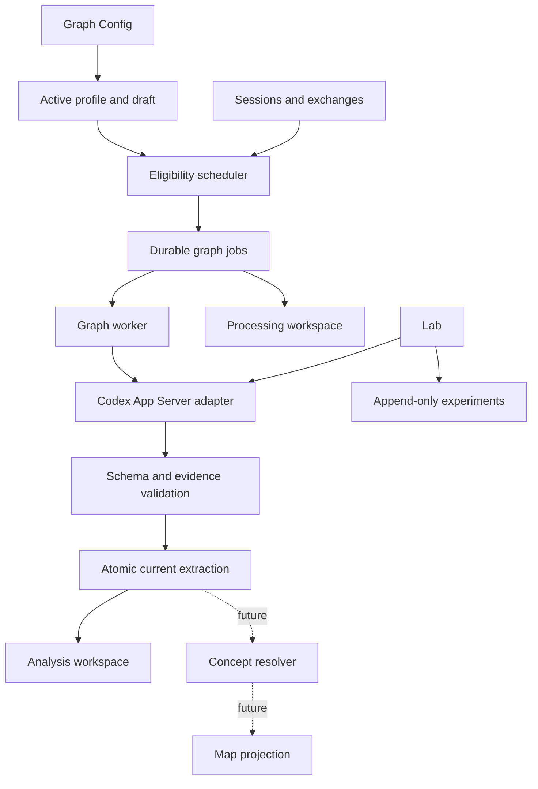
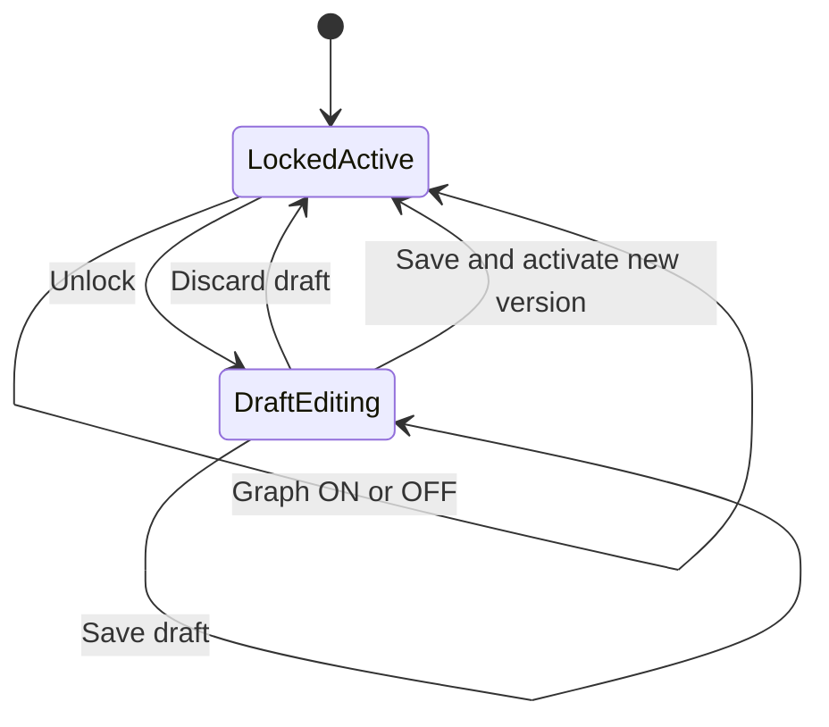
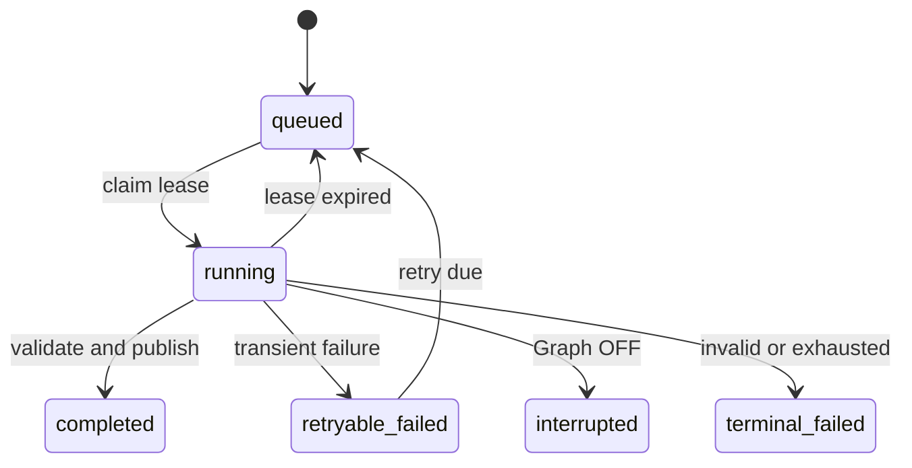

# feat: Add Graph workspace and extraction pipeline

## Goal Capsule

- **Objective:** Turn Admin Viewer into a multi-workspace shell and add a durable Graph subsystem that can automatically extract session concepts through Codex, expose its state, and grow later into resolution and visualization without replacing the foundation.
- **Authority:** This conversation's settled product decisions govern UI naming, pipeline controls, inactivity semantics, provider availability, and extractor locking.
- **Execution profile:** Deliver in vertical slices; each slice must leave stored state truthful and the UI usable even while later Graph stages remain unavailable.
- **Stop condition:** Do not present Map, resolver, API billing, or automatic extraction as functional before their backing data and execution paths exist.

---

## Product Contract

### Summary

Graph is a first-class Admin Viewer workspace parallel to Sessions. It owns the end-to-end derived knowledge pipeline: configuration, automatic extraction, processing visibility, per-session analysis, concept resolution, experiments, and ultimately the Map. The first implementation establishes the complete navigation and persistence boundaries, then activates stages one by one.

### Problem Frame

The current Admin Viewer is a single Sessions page with dialogs embedded in one large HTML asset. Concept extraction needs persistent policy, durable work state, model execution, review surfaces, and future resolver/map data. Adding these concerns to the Sessions page would couple unrelated lifecycles and make future Contexts work harder to introduce.

### Actors

- A1. **Owner:** configures and operates Graph, reviews production analyses, and runs Lab experiments.
- A2. **Scheduler:** determines when a session has been inactive long enough to become eligible.
- A3. **Graph worker:** executes a pinned production profile through the selected provider and persists an atomic result.

### Requirements

**Workspace and navigation**

- R1. Admin Viewer exposes top-level Sessions, Graph, and disabled Contexts destinations in a shared shell; Graph has its own route and assets.
- R2. Graph navigation is ordered Map, Config, Processing, Analysis, Concepts, Lab; Map is first because it becomes the long-term default destination.
- R3. Unimplemented stages stay visible but clearly disabled instead of implying working functionality.

**Holistic control and provider readiness**

- R4. Config contains a prominent Graph ON/OFF switch governing all automatic Graph processing while preserving stored results and configuration.
- R5. Graph cannot be enabled without a ready compute provider and tells the owner how to configure one.
- R6. Codex is the only enabled provider initially; API is visible but disabled as future work.
- R7. Turning Graph OFF stops new claims, requests interruption of active Graph-owned Codex turns, discards partial results, and retains prior completed data.

**Versioned extractor policy**

- R8. Config exposes provider, model, reasoning effort, editable extractor prompt, maximum concept count, inclusion scope, and inactivity threshold.
- R9. Inactivity choices are 1h, 3h, 6h, and 24h, defaulting to 24h; they mean time since a particular session's last activity, never a periodic full-database rescan.
- R10. The active extractor profile is locked by default. Unlocking creates or exposes a draft; edits cannot mutate the active profile in place.
- R11. Saving and activating a draft creates an immutable profile version, re-locks editing, and marks prior production analyses stale without deleting them.
- R12. The production Structured Output schema is application-owned and versioned; users can edit extraction instructions but not silently redefine stored result shape.

**Execution and results**

- R13. Eligible sessions are queued idempotently from their latest exchange watermark and active profile version; repeated scheduler passes do not duplicate equivalent work.
- R14. A production run writes one current extraction per session atomically, retaining enough revision and job metadata for audit, retry, and stale-state explanation.
- R15. Sensitive groups are excluded by default and scope decisions are explicit in Config.
- R16. Processing separately shows queued, running, retryable failure, terminal failure, interrupted, and completed jobs with actionable context.
- R17. Analysis shows per-session derived concepts, evidence, profile version, source watermark, freshness, and job history without pretending it is the original Sessions transcript.
- R18. Failed or partial model responses never replace the last complete production analysis.

**Lab and future graph stages**

- R19. Lab runs append-only experiments against selected sessions and explicit draft/profile settings without overwriting production analyses or automatically changing active policy.
- R20. Concepts is the future resolver workspace inside Graph; Map is driven only by resolved concepts and relations, not raw extractor labels.
- R21. Storage and service boundaries provide explicit extension points for resolver outputs, concept aliases, relations, and map projections without requiring production extraction tables to be repurposed.

### Key Flows

- F1. **Activate Graph:** Owner opens Config, verifies Codex readiness, unlocks or accepts the draft policy, activates a version, and turns Graph on.
- F2. **Automatic extraction:** Scheduler finds a non-sensitive session inactive beyond the policy threshold, claims one idempotent job, worker runs Codex with the fixed schema, and atomically publishes the result.
- F3. **Change policy:** Owner unlocks Config, edits a draft while the active version remains live, then activates a new immutable version; existing analyses become visibly stale and are reconsidered by eligibility logic.
- F4. **Stop processing:** Owner turns Graph off; no new jobs are claimed, active Graph-owned turns are interrupted, partial output is discarded, and completed analyses remain browsable.
- F5. **Experiment safely:** Owner chooses a session in Lab, changes experimental settings, runs a test, and compares append-only output without mutating production state.

### Acceptance Examples

- AE1. Given Graph is off, when a session passes its inactivity threshold, then no extraction job is claimed and existing analyses remain unchanged.
- AE2. Given Graph is on with a 3h threshold, when one session has been idle 4h and another 2h, then only the first is eligible; the scheduler does not scan either again merely because three wall-clock hours elapsed.
- AE3. Given active profile v2 is locked, when the owner unlocks and edits its prompt, then production continues using v2 until the draft is explicitly activated as v3.
- AE4. Given an extraction for a session and profile/source watermark already exists, when eligibility is evaluated repeatedly, then only one equivalent job/result exists.
- AE5. Given a Codex turn returns invalid structured output or is interrupted, when the run finishes, then the previous complete analysis remains current and the job exposes the failure.
- AE6. Given a session belongs to a sensitive group, when the scheduler evaluates it under default scope, then it is excluded and the UI explains why.
- AE7. Given a Lab experiment completes, when Analysis is opened, then its result is absent from production analysis unless separately activated through a future explicit workflow.

### Scope Boundaries

#### Included

- Multi-workspace Admin shell and the Graph workspace information architecture.
- Persistent Graph configuration with immutable active profiles and lock/draft interaction.
- Durable extraction jobs, current production results, history metadata, scheduler, Codex Structured Output execution, Processing, Analysis, and Lab test runs.
- Disabled extension surfaces and storage boundaries for resolver, concepts, relations, and Map.

#### Deferred to Follow-Up Work

- Resolver algorithms and canonical-concept management.
- Map layout, graph exploration, and relation inference.
- API provider execution and billing/key configuration.
- Contexts workspace implementation.
- Automated reprocessing campaigns beyond normal per-session eligibility.

#### Outside This Product's Identity

- Editing original session transcripts from Graph.
- Letting experimental runs silently replace production truth.
- Running Graph against sensitive groups without an explicit owner policy change.

### Key Product Decisions

- **Top navigation over a permanent rail** (session-settled: user-directed — chosen over a left application rail because the rail doubled the information density of the Sessions workspace). Governs R1.
- **Graph is the umbrella name** (session-settled: user-directed — chosen over Concepts because Graph covers extraction, resolution, experiments, and visualization). Governs R1-R3, R20-R21.
- **Map comes first; Config centralizes policy** (session-settled: user-directed — chosen to optimize the mature product's primary use while keeping every pipeline stage configurable in one place). Governs R2-R3, R8.
- **Idle eligibility is per session** (session-settled: user-directed — clarified against periodic full-database rescans). Governs R9, R13.
- **Graph has one master switch** (session-settled: user-directed — owner must control subscription consumption holistically). Governs R4-R7.
- **Active extractor policy is locked and versioned** (session-settled: user-directed — chosen to discourage casual production changes while retaining intentional control). Governs R10-R12.

Product Contract unchanged from the settled session scope; this artifact adds the implementation contract without changing product behavior.

---

## Planning Contract

### Key Technical Decisions

- KTD1. **Separate Graph boundary.** Add a dedicated Graph handler/service and HTML/CSS/JS assets rather than extending `static/admin-viewer.html`; reuse the existing admin authentication and security-header helpers. (session-settled: user-approved — chosen over further growth of the monolithic Sessions asset.)
- KTD2. **Normalized domain tables plus small app settings.** Store master state and the current draft pointer in `app_settings`, while immutable profiles, jobs, runs, results, concepts, evidence, and Lab experiments use relational tables. Large/versioned JSON blobs do not belong in `app_settings`.
- KTD3. **Watermark-based idempotency.** Define equivalent production work by session, latest included exchange ID, extractor profile version, and schema version. Enforce it with database uniqueness, not scheduler timing.
- KTD4. **Lease-based durable jobs.** Workers atomically claim queued/retryable jobs with a lease; startup recovers expired running jobs. The process-local Search rebuild thread is a behavioral precedent, not a sufficient durability mechanism.
- KTD5. **Fail-closed Codex extraction adapter.** Add a dedicated structured extraction operation to `CodexAppServerClient` with fixed sandbox/tool/MCP restrictions, caller-selected model/effort from validated allowlists, application-owned `outputSchema`, explicit interruption, and no generic tool surface.
- KTD6. **Atomic publication.** Persist parsed output, evidence, and current-result pointer in one transaction only after full validation. Job logs may record failure independently; partial extraction data never becomes current.
- KTD7. **One shell contract, independently releasable workspaces.** Extract only the small shared navigation/style behavior needed by Sessions and Graph; do not refactor all Sessions internals as a prerequisite.
- KTD8. **Production and Lab isolation.** Production current results and Lab experiments have separate ownership fields and queries. Lab may reference a profile or draft snapshot but cannot call the production publication path.

### High-Level Technical Design

### Data Ownership

- `graph_extractor_profiles`: immutable activated policy versions and their application schema version.
- `graph_extractor_drafts`: at most one mutable owner draft, separate from active production policy.
- `graph_jobs`: durable lifecycle, uniqueness key, lease, attempts, provider/model metadata, and sanitized error state.
- `graph_extractions`: immutable validated production revisions keyed to source watermark and profile.
- `graph_extraction_concepts` and `graph_extraction_evidence`: normalized raw extractor findings and literal transcript references.
- `graph_session_current`: one pointer per session to the published current extraction.
- `graph_lab_runs`: append-only input snapshot, status, validated result, and error metadata with no current-production pointer.
- Future `graph_concepts`, aliases, memberships, relations, and projections consume raw extraction IDs rather than rewriting them.

### Sequencing

1. Establish the workspace shell, Graph route, persistent Config contract, and truthful disabled states.
2. Add immutable profile/draft storage and enforce lock/activation server-side.
3. Add durable jobs and eligibility without model execution; prove idempotency and OFF behavior.
4. Extend the Codex adapter, execute extraction, and publish validated results atomically.
5. Activate Processing and Analysis views.
6. Add isolated Lab runs.
7. Leave resolver and Map disabled until their own feature plans implement them.

### Assumptions

- The first production schema follows the concept/evidence shape already tested in the evaluation harness; exact field vocabulary is checked against those artifacts during U4.
- A single Bridge process may schedule and execute jobs initially, but leases and database uniqueness must remain correct if a second worker process is added later.
- Automatic retries use bounded exponential delay for transient Codex failures; validation/policy failures require an explicit retry after configuration or code changes.
- Existing completed extraction remains visible with a stale badge after source or profile changes until a new extraction publishes successfully.

---

## Implementation Units

### U1. Shared workspace shell and Graph foundation

- **Goal:** Add the top-level Admin Viewer navigation and a separate Graph page with Config as the functional initial screen and truthful disabled destinations.
- **Requirements:** R1-R3, R5-R6; KTD1, KTD7.
- **Dependencies:** None.
- **Files:** `app/main.py`, `app/admin.py`, `app/graph_admin.py`, `static/admin-viewer.html`, `static/graph-viewer.html`, `static/graph-viewer.css`, `static/graph-viewer.js`, `tests/test_admin.py`, `tests/test_graph_admin.py`.
- **Approach:** Reuse admin-cookie, CSRF, no-store, and content-security conventions. Add the minimal shared nav markup/style to Sessions and Graph without extracting or rewriting unrelated Sessions JavaScript. Render Contexts, API provider, Map, Concepts, Processing, Analysis, and Lab according to actual readiness.
- **Patterns to follow:** `AdminHandlers.sessions_page`, `_require_admin`, `_admin_headers`, and existing admin JSON error conventions.
- **Test scenarios:**
  - Anonymous requests to `/admin/graph` redirect to login with a safe return path.
  - Authenticated requests receive no-store and the existing security headers.
  - Sessions and Graph nav links identify the current workspace; Contexts is non-interactive.
  - Config exposes Codex and disabled API choices; unavailable stages cannot be activated through hidden links.
- **Verification:** Both workspace routes render under the same admin session without changing existing Sessions interactions.

### U2. Versioned Graph configuration and lock semantics

- **Goal:** Persist master state, immutable extractor profiles, and one mutable draft while enforcing lock/activate behavior on the server.
- **Requirements:** R4-R12, R15; F1, F3; AE1, AE3, AE6; KTD2.
- **Dependencies:** U1.
- **Files:** `app/storage.py`, `app/graph_config.py`, `app/graph_admin.py`, `static/graph-viewer.js`, `tests/test_bridge_database.py`, `tests/test_graph_config.py`, `tests/test_graph_admin.py`.
- **Approach:** Validate provider, model, effort, prompt bounds, maximum concepts, inactivity enum, and scope. Unlock copies the active profile to a draft. Activation creates a new immutable profile and updates the active pointer in one transaction. Graph enablement checks provider readiness before persisting ON.
- **Execution note:** Implement domain and HTTP behavior test-first because profile immutability is a cross-layer invariant.
- **Test scenarios:**
  - Fresh databases seed a locked default draft/profile with 24h inactivity and Graph OFF.
  - Unlocking copies active v1; editing draft does not alter v1 or the active response.
  - Activating a valid draft creates v2, switches the pointer, deletes/re-locks the draft, and reports existing results stale.
  - Invalid inactivity, blank prompt, unsupported model/effort, or enabled API provider is rejected without partial persistence.
  - Graph enablement fails with a clear prerequisite code when Codex is unconfigured or logged out.
  - Sensitive groups remain excluded by default and can be included only through explicit scope configuration.
- **Verification:** Database and HTTP tests prove no endpoint can mutate an activated profile and Config reloads exactly the active/draft states.

### U3. Durable eligibility and processing lifecycle

- **Goal:** Queue and manage idempotent per-session extraction jobs based on inactivity, source watermark, and active profile.
- **Requirements:** R4, R7, R9, R13, R15-R16; F2, F4; AE1, AE2, AE4, AE6; KTD3-KTD4.
- **Dependencies:** U2.
- **Files:** `app/storage.py`, `app/graph_jobs.py`, `app/main.py`, `app/settings.py`, `tests/test_bridge_database.py`, `tests/test_graph_jobs.py`, `tests/test_graph_runtime.py`.
- **Approach:** Use a lightweight periodic scheduler that asks storage for eligible sessions rather than walking and executing them inline. Queue with a database uniqueness key. Claim with a lease and attempts. Graph OFF blocks enqueue/claim and signals active task cancellation; startup recovers expired leases.
- **Execution note:** Start with storage-level concurrency and idempotency tests before adding the runtime loop.
- **Test scenarios:**
  - Covers AE2. A 3h policy queues only sessions whose latest included exchange is at least 3h old.
  - Repeated eligibility passes for the same session/watermark/profile produce one job.
  - A new exchange or activated profile creates a distinct eligible work key and makes the prior current result stale.
  - Two claimers cannot own the same job; an expired lease becomes claimable again.
  - Graph OFF prevents new claims and moves a cancelled active job to interrupted without publishing output.
  - Sensitive, empty, deleted-only, or otherwise out-of-scope sessions are skipped with a queryable reason where useful.
- **Verification:** Tests prove eligibility semantics independently of wall-clock scheduler cadence and survive process restart.

### U4. Structured Codex extraction and atomic publication

- **Goal:** Execute production jobs through Codex with an application-owned schema and publish only fully validated results.
- **Requirements:** R6, R12-R14, R18; F2, F4; AE4-AE5; KTD5-KTD6.
- **Dependencies:** U3.
- **Files:** `app/codex_app_server.py`, `app/graph_extractor.py`, `app/graph_jobs.py`, `app/storage.py`, `tests/test_codex_app_server.py`, `tests/test_graph_extractor.py`, `tests/test_graph_runtime.py`.
- **Approach:** Build the source transcript from eligible, non-deleted exchanges under explicit size policy. Start an ephemeral restricted Codex thread, pass validated model/effort plus fixed `outputSchema`, reject tool/server requests, and parse the final structured payload. Validate evidence against the exact source before one-transaction publication and current-pointer switch.
- **Execution note:** Preserve fail-closed adapter characterization tests before broadening the protocol allowlist.
- **Test scenarios:**
  - Valid structured output produces one extraction, normalized concepts/evidence, completed job, and current pointer atomically.
  - Unknown output fields, malformed JSON, invalid concept types, missing literal evidence, or evidence not found in source fail without replacing current data.
  - Timeout/unavailability becomes retryable; policy/protocol/schema violations become terminal until explicitly retried.
  - Graph OFF during a running turn requests interruption and discards late completion notifications.
  - Model and effort are passed to the pinned protocol while tools, web, approvals, and external MCP remain unavailable.
  - Transcript size handling is deterministic and recorded with the extraction source watermark.
- **Verification:** Adapter fixtures and integration tests prove the exact App Server request shape and last-good-result preservation.

### U5. Processing and Analysis workspaces

- **Goal:** Turn operational/job state and per-session production findings into separate, inspectable Graph views.
- **Requirements:** R2-R3, R11, R14, R16-R18; F2-F4; AE3-AE5.
- **Dependencies:** U3, U4.
- **Files:** `app/graph_admin.py`, `app/storage.py`, `static/graph-viewer.html`, `static/graph-viewer.css`, `static/graph-viewer.js`, `tests/test_graph_admin.py`.
- **Approach:** Processing queries job lifecycle and sanitized error/retry data. Analysis queries sessions joined to current extraction and freshness causes, then drills into raw concepts, evidence, profile, watermark, and revision history. Both use pagination and server-side filtering; neither fetches all records into browser memory.
- **Test scenarios:**
  - Processing filters each lifecycle state and returns stable pagination under concurrent job updates.
  - Analysis distinguishes current, stale-by-new-exchange, stale-by-profile, never-scanned, excluded, and failed-with-last-good states.
  - Evidence safely renders literal text without HTML execution and links back to session identity without enabling Graph transcript edits.
  - Retry is CSRF-protected, rejects ineligible terminal policy errors, and creates no duplicate equivalent work.
- **Verification:** The two views remain semantically distinct and every displayed status is derived from durable state, not guessed client-side.

### U6. Isolated Lab experiments

- **Goal:** Let the owner run and compare manual extractor experiments without changing production policy or results.
- **Requirements:** R2-R3, R19; F5; AE7; KTD8.
- **Dependencies:** U2, U4.
- **Files:** `app/graph_lab.py`, `app/graph_admin.py`, `app/storage.py`, `static/graph-viewer.html`, `static/graph-viewer.css`, `static/graph-viewer.js`, `tests/test_graph_lab.py`, `tests/test_graph_admin.py`.
- **Approach:** Snapshot the selected session watermark and all experiment settings at run creation. Reuse the extraction validator and restricted Codex operation, but persist to Lab-owned tables and expose compare/rerun/delete-display operations that never call production publication.
- **Test scenarios:**
  - A Lab run against a session stores its full settings snapshot and validated result while production current remains unchanged.
  - Changing or deleting a draft after run creation does not change historical experiment interpretation.
  - Failed and interrupted runs retain sanitized diagnostics but no partial concepts.
  - Two experiments can compare model/prompt outputs for the same source watermark.
  - Graph OFF blocks automatic production work but still clearly communicates whether manual Lab runs are allowed; initial policy is to block them to honor the holistic master switch.
- **Verification:** Storage and API tests prove there is no code path from Lab completion to `graph_session_current`.

### U7. Resolver and Map extension contracts

- **Goal:** Define stable disabled-state contracts and schema extension seams so future resolver/Map work consumes extractor output without a migration rewrite.
- **Requirements:** R2-R3, R20-R21; KTD2, KTD8.
- **Dependencies:** U5.
- **Files:** `app/storage.py`, `app/graph_admin.py`, `static/graph-viewer.html`, `static/graph-viewer.js`, `tests/test_bridge_database.py`, `tests/test_graph_admin.py`.
- **Approach:** Add only the minimum foreign-key-ready identifiers/status summaries needed by future stages. Keep resolver and Map routes disabled with explicit prerequisite copy; do not invent algorithms or seed fake graph data.
- **Test scenarios:**
  - Raw extraction revisions remain addressable after a new current revision publishes.
  - Disabled resolver and Map surfaces return truthful prerequisite/status payloads and cannot mutate data.
  - Database integrity prevents future resolver artifacts from referencing missing extraction concepts.
- **Verification:** A future resolver plan can add canonical entities and relations by consuming stable extraction IDs, without changing production extraction meaning.

---

## Verification Contract

| Gate | Applies to | Done signal |
|---|---|---|
| Focused unit tests | U1-U7 | New Graph domain, adapter, route, and storage scenarios pass. |
| Full Python test suite | U1-U7 | Existing Sessions, OAuth, Search, files, CLI, and Codex tests remain green. |
| Static diff validation | U1-U7 | No whitespace errors, accidental AppleDouble files, secrets, or generated protocol output enter the diff. |
| Auth and CSRF regression | U1, U2, U5, U6 | Every Graph read requires admin auth; every mutation additionally requires CSRF. |
| Runtime smoke | U1-U6 | Bridge and Codex sidecar start; `/healthz`, Sessions, Graph Config, provider status, and Graph APIs behave correctly on the VPS. |
| Manual browser QA | U1, U2, U5, U6 | Desktop and narrow layouts preserve navigation, lock clarity, disabled states, Processing readability, Analysis evidence, and Lab isolation. |
| Failure recovery smoke | U3-U4 | Restart and Graph OFF during work leave no stuck lease or partial current extraction. |

---

## Definition of Done

- The Admin Viewer has a working Sessions/Graph shell with disabled Contexts and Graph stage navigation matching the settled information architecture.
- Graph Config is durable, validates Codex readiness, implements the master switch, and enforces locked immutable active profiles plus drafts.
- The 1h/3h/6h/24h policy operates on per-session inactivity and queues idempotent durable work.
- Codex extraction remains restricted and fail-closed, validates the fixed schema and evidence, and atomically preserves the last good analysis on every failure path.
- Processing and Analysis expose truthful, durable state; Lab experiments are append-only and production-isolated.
- Resolver, Concepts, relations, Map, API provider, and Contexts remain clearly deferred rather than simulated.
- New focused tests and the complete existing suite pass on the VPS; services restart and health checks succeed.
- No unrelated user files are modified, committed, pushed, or deployed as part of this work.

