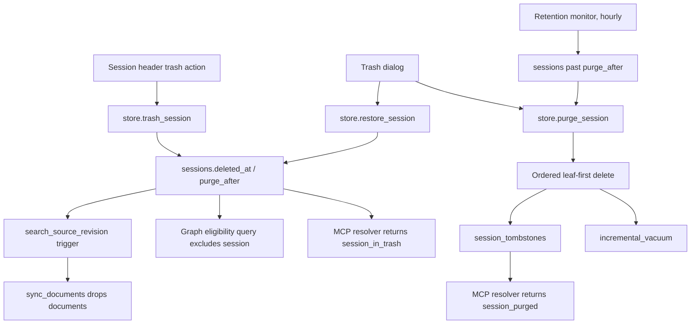
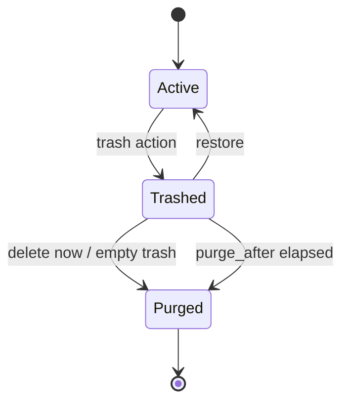

# feat: Add session trash with restore and timed purge

## Goal Capsule

- **Objective:** Let the owner remove a session from the working surface immediately and reversibly, keep it restorable for a configured retention window, and permanently erase it — together with everything derived from it — either on demand or automatically when the window expires.
- **Authority:** NIV-5 and this conversation's settled decisions govern retention semantics, the "delete now" escape hatch, model-facing error behavior, and the trash surface being a dialog rather than a workspace.
- **Execution profile:** Three releasable stages — reversible trash first, containment second, destruction last. Every stage must leave stored state truthful even if the following stage never ships.
- **Stop condition:** Do not ship automatic purge before search, Graph, files, admin events, and the model-facing surface all agree that a trashed session is gone.

---

## Product Contract

### Summary

Sessions gain a trash. A trash action in the session header moves a session out of the working surface without destroying it. A dedicated Trash dialog lists what is in there, how long each item has left, and offers Restore, Export, and an explicit permanent delete. Sessions left in the trash are erased automatically once their stored purge date passes. Models reaching a trashed session get a distinct, actionable error instead of a lookup failure.

### Problem Frame

Bridge has no way to remove a session. Two soft-delete mechanisms exist — `session_groups.deleted_at` and `exchanges.deleted_at` — and both are permanent-by-omission: the row is hidden forever but never erased. Sessions have nothing at all.

The concrete trigger is duplicate sessions. A harness reconnect or a dropped connection makes a client create a second session for the same topic, and the duplicate stays in the list forever. On claude.ai or chatgpt.com the user deletes it in two clicks; in Bridge it accumulates. The secondary driver is ordinary tidiness: an owner who wants the session list to reflect work that still matters.

This makes the trash the first mechanism in Bridge that destroys data irreversibly, and the first that does so on a timer. That raises the bar: the purge must be audited, idempotent, and must sweep every derived store, not just the session row.

### Actors

- A1. **Owner:** trashes, restores, exports, and permanently deletes sessions through Admin Viewer, and sets the retention window.
- A2. **Retention worker:** erases sessions whose stored purge date has passed.
- A3. **Model client:** reaches a session through MCP tools and must be told clearly when that session is in the trash or already purged.

### Requirements

**Trash lifecycle**

- R1. The session header exposes a trash action; trashing is always reversible and never destroys content at the moment it is invoked.
- R2. A trashed session disappears from the session list, from group session counts, and from every default session query in the admin API.
- R3. The Trash dialog lists trashed sessions newest-deletion-first with title, origin group, exchange count, stored size, deletion date, remaining time, and the exact purge date.
- R4. Restore returns a session to its origin group with all exchanges, files, and history intact, and re-enables every normal operation on it.
- R5. Permanent deletion of a single session is available from the Trash dialog behind a confirmation that requires typing the session title.
- R6. Empty trash permanently deletes every trashed session behind a single explicit confirmation.
- R7. A trashed session can be exported to HTML from the Trash dialog before it is purged.
- R8. A trashed session whose origin group is sensitive stays covered by the sensitive curtain inside the Trash dialog.

**Retention policy**

- R9. Trashing stores an absolute `purge_after` timestamp derived from the retention setting in force at that moment.
- R10. Settings › General exposes retention as a fixed choice of 7, 14, 30, 60, or 90 days, defaulting to 30.
- R11. Changing the retention setting never moves `purge_after` for sessions already in the trash; the settings field states this in place.
- R12. Automatic purge runs inside the Bridge process, at most hourly, is idempotent, and logs how many sessions it erased.

**Model-facing behavior**

- R13. Every MCP read of a trashed session — overview, transcript chunk, last speaker, file list, file download — fails with a distinct `session_in_trash` error carrying the purge date, never with `Unknown session_id`.
- R14. `save_exchange` against a trashed session fails with the same distinct error and never writes, so a lost turn is visible instead of silent.
- R15. Model access never restores a session; restore is an explicit owner action in Admin Viewer.
- R16. After a purge, a tombstone lets MCP answer `session_purged` with the purge date rather than reporting an unknown session.
- R17. `list_session_groups` and `create_session` are unaffected; the trash is not a group.

**Derived data and destruction**

- R18. Trashing removes the session from the search index and makes it ineligible for Graph work immediately; restore puts it back.
- R19. Purge deletes, in one transaction, the session row, its exchanges, its session-scoped files including binary content, its exchange admin events, and all Graph rows referencing it.
- R20. Purge accounts for reclaiming database file space rather than silently leaving it allocated.
- R21. Trash, restore, and purge are recorded with actor and timestamp in a queryable audit trail.

### Key Flows

- F1. **Trash a duplicate:** Owner opens the accidentally duplicated session, clicks the trash action, confirms, and the session leaves the list at once.
- F2. **Recover a mistake:** Owner opens the Trash dialog, selects the session, reads the read-only preview, and restores it to its origin group.
- F3. **Tidy up for good:** Owner opens the Trash dialog, uses Delete now on an obvious duplicate, types the title to confirm, and the session and everything derived from it is erased immediately.
- F4. **Timed erasure:** Retention worker finds sessions whose stored purge date has passed and erases them, leaving only tombstones.
- F5. **Model hits a trashed session:** A client calls `get_session_overview` or `save_exchange` on a trashed id, receives `session_in_trash` with the purge date, and can tell the user to restore it in Admin Viewer.

### Acceptance Examples

- AE1. Given a session is trashed, when the session list, group counts, and the default sessions API are queried, then it appears in none of them and the Trash dialog count increases by one.
- AE2. Given a session trashed from group "Local dev", when it is restored, then it returns to "Local dev" with the same exchanges, files, and excluded-turn state as before.
- AE3. Given retention is 30 days and a session is trashed on 5 September, when retention is later changed to 90 days, then that session still shows a 5 October purge date.
- AE4. Given a session whose purge date has passed, when the retention worker runs, then the session, its exchanges, its files, its exchange admin events, and its Graph rows are gone and one tombstone remains.
- AE5. Given a session is trashed, when a model calls `save_exchange` on it, then nothing is written and the response is `ok:false` with error code `session_in_trash` and the purge date.
- AE6. Given a session was purged yesterday, when a model calls `get_session_overview` on its id, then the response is `session_purged` with the purge date, not `Unknown session_id`.
- AE7. Given a session is trashed, when a search is run over its content, then no result from that session is returned; when it is restored, then its results return without a manual reindex.
- AE8. Given a session is trashed while a Graph job for it is queued or running, then no result is published for it and the job ends without touching `graph_session_current`.
- AE9. Given the purge deletes a session with an uploaded PDF, when the operation completes, then the exchange admin events for that session are gone as well and the freed database pages are reclaimed.
- AE10. Given a trashed session from a sensitive group, when its preview is opened in the Trash dialog, then the sensitive curtain covers it exactly as in the Sessions workspace.

### Scope Boundaries

#### Included

- Reversible session trash with restore, a Trash dialog, and the session-header trash action.
- Stored per-session purge date, a General retention setting, and an in-process retention worker.
- Distinct model-facing errors for trashed and purged sessions, backed by a tombstone.
- Full destructive purge across sessions, exchanges, files, admin events, and Graph tables.
- Removal from and restoration to the search index and Graph eligibility.

#### Deferred to Follow-Up Work

- Duplicate-session detection or merge suggestions.
- Bulk multi-select trashing from the session list.
- Trashing individual exchanges, files, or groups through this mechanism.
- Restoring a purged session from a database export.
- Retention policy per group.

#### Outside This Product's Identity

- Destroying a session without a reversible intermediate state.
- Letting a model create, restore, or destroy sessions.
- Retention changes that retroactively shorten an already promised purge date.

### Key Product Decisions

- **The trash is orthogonal to grouping** (session-settled: user-approved — chosen over a system "Trash" group because a group carries sensitivity, group-scoped files, and a session's real category, all of which restore must preserve). Governs R1-R4, R17.
- **`purge_after` is stored, not derived** (session-settled: user-approved — an irreversible deletion date shown to the owner must not move when policy changes). Governs R9, R11, AE3.
- **Delete now exists despite the 30-day default** (session-settled: user-directed — a duplicate created three minutes ago should not occupy the trash for a month, and pasted-by-mistake content must be erasable on demand; the reversible first click still absorbs the accidental case). Governs R5, R6, F3.
- **Trashed sessions are invisible to models, and loudly so** (session-settled: user-approved — server instructions tell models to always call `save_exchange`, so a generic lookup failure would silently drop a turn). Governs R13-R16.
- **The trash is a dialog, not a workspace** (session-settled: user-approved — chosen over a pseudo-group in the sidebar, which would force the whole Sessions main pane into a read-only mode and leak "dead session" state into code that assumes a live one). Governs R3, R7, R8.
- **The tombstone keeps the title only for non-sensitive origins** (plan-level decision — answering "where did my session go" is worth a permanent row, but a title from a sensitive group is exactly the content the owner asked to destroy). Governs R16, R21.

---

## Planning Contract

### Key Technical Decisions

- KTD1. **Flag on `sessions`, not a separate table.** Add `deleted_at`, `deleted_by`, and `purge_after` columns via the existing `_ensure_column` path. A `sessions_trash` table would break the `ON DELETE CASCADE` edges from `exchanges`, `session_files`, and every Graph table, forcing children to move with the parent.
- KTD2. **Separate trash endpoints, not a flag on the existing listing.** `GET /admin/api/sessions/trash` and its own mutations, while `GET /admin/api/sessions` gains an unconditional `deleted_at IS NULL` filter with no override parameter. There is then no query-string that leaks a trashed session into the normal list.
- KTD3. **Search self-heals; do not write indexing code.** `search_source_revision` already has an `AFTER UPDATE ON sessions` trigger, and `sync_documents` deletes documents whose keys vanish from `_source_rows`. Adding `AND s.deleted_at IS NULL` to both queries in `_source_rows` makes trash removal and restore propagate to FTS and to vector chunks through the existing monitor.
- KTD4. **Purge is an explicit ordered transaction, never a bare `DELETE FROM sessions`.** With `PRAGMA foreign_keys=ON`, the cascade from `sessions` reaches `exchanges` and `graph_extractions` independently, while `graph_extraction_evidence.exchange_id`, `graph_jobs.source_exchange_id`, and `graph_extractions.job_id` are non-cascading references — cascade ordering is not guaranteed and can raise a constraint failure. Separately, `exchange_admin_events` has no foreign key at all, so its rows, which contain `before_json`/`after_json` copies of exchange content, would survive the cascade entirely. Delete leaf-first in a single transaction: evidence, concepts, extractions, `graph_session_current`, lab runs, jobs, admin events, files, exchanges, session.
- KTD5. **Retention worker as a third lifespan monitor.** Mirror `_search_index_monitor` and `_graph_pipeline_monitor` in `app_lifespan` with an hourly tick. No cron and no systemd timer: purge is a database operation with no external dependency, and a long-powered-off host simply purges shortly after boot.
- KTD6. **Trash dialog reuses the file-workspace two-pane shape.** `fileWorkspaceDialog` already provides list-plus-detail with responsive collapse to a single column; `admin-confirmation.js` already provides the destructive confirmation. No new UI primitives.
- KTD7. **Tombstones are a small append-only table, not a resurrectable archive.** `session_tombstones` stores id, origin group, creation, deletion and purge timestamps, exchange count, and a nullable title. It exists to answer lookups and to audit, never to restore.
- KTD8. **Incremental vacuum after a purge that freed blobs.** The database sets only `journal_mode` and `foreign_keys`; without vacuuming, erasing a session containing PDFs leaves the file size unchanged, which reads as a failed deletion. Run `PRAGMA incremental_vacuum` after a purge batch, guarded so it never runs inside the purge transaction.

### High-Level Technical Design

### Data Ownership

- `sessions.deleted_at`, `deleted_by`, `purge_after`: trash state and the promised erasure date; all three null for an active session.
- `session_tombstones`: append-only record of purged sessions; the only thing that outlives a purge.
- `session_admin_events`: actor-attributed trail of `trashed`, `restored`, and `purged` actions, following the shape of `exchange_admin_events`.
- `app_settings["trash.retention_days"]`: current retention window, consulted only at trash time.
- Search, Graph, files, and exchange tables own nothing new; they gain filters and are targets of the ordered purge.

### Sequencing

1. Storage-level trash, restore, and ordered purge with tombstones and audit, proven by database tests before any surface uses them.
2. Admin API endpoints and the unconditional listing filter.
3. Model-facing resolution: trashed and purged errors, updated server instructions.
4. Derived-data containment: search filter, Graph eligibility, in-flight job handling, export from trash.
5. Admin Viewer: header action, Trash dialog, countdown, confirmations, retention setting.
6. Retention worker, vacuum, operational visibility, documentation.

### Assumptions

- Column additions use `_ensure_column` and new tables use the `CREATE TABLE IF NOT EXISTS` init block, so `SCHEMA_VERSION` stays at 2 as with previous additive changes.
- A single Bridge process runs the retention worker; the purge is written to be safe if a second one is added later.
- Remaining time is rendered client-side from `purge_after` in whole days, switching to hours under one day, without a ticking timer.
- Graph work in flight for a session being trashed is handled by eligibility exclusion plus a publication guard, not by a new cancellation protocol.
- Restoring a session relies on the search monitor's normal 30-second cadence; an immediate synchronous reindex is not required.

---

## Implementation Units

### U1. Storage: trash state, tombstones, ordered purge

- **Goal:** Give the domain layer trash, restore, and destructive purge with correct audit and referential behavior, independent of any surface.
- **Requirements:** R1, R2, R4, R9, R19, R21; AE1, AE2, AE4, AE9; KTD1, KTD4, KTD7.
- **Dependencies:** None.
- **Files:** `app/storage.py`, `tests/test_bridge_database.py`, `tests/test_sessions.py`.
- **Approach:** Add the three session columns, `session_tombstones`, and `session_admin_events`. Implement `trash_session`, `restore_session`, `purge_session`, `purge_due_sessions`, `list_trashed_sessions`, and `get_tombstone`. `trash_session` reads `trash.retention_days` and stamps `purge_after`. `purge_session` performs the leaf-first ordered delete described in KTD4 inside one transaction and writes the tombstone in the same transaction. Add `deleted_at IS NULL` to `get_session`, the session listing query, and the Graph eligibility query at `storage.py:1238`.
- **Patterns to follow:** `delete_session_group`, `_ensure_column`, `exchange_admin_events` writes, and the existing `self._lock, self._connect()` transaction shape.
- **Execution note:** Write the purge ordering test first. It is the one place where getting it wrong either raises a constraint failure or silently orphans content-bearing rows.
- **Test scenarios:**
  - Trashing stamps `deleted_at`, `deleted_by`, and `purge_after` from the current retention setting and leaves all content intact.
  - Restore clears all three, returns the session to its origin group, and preserves excluded-exchange state.
  - Covers AE4 and AE9. Purging a session with exchanges, a text file, a PDF with binary content, exchange admin events, and a complete Graph extraction chain removes every one of those rows and raises no foreign-key error.
  - `exchange_admin_events` rows for the purged session are gone; rows for other sessions are untouched.
  - A tombstone is written with the correct timestamps, and its title is null when the origin group was sensitive.
  - `purge_due_sessions` erases only sessions whose `purge_after` has passed, is safe to call twice, and reports a count.
  - `get_session` and the default listing exclude trashed sessions; the Graph eligibility query skips them.
- **Verification:** Database tests prove no purge path leaves a row referencing a purged session and no active-session query returns a trashed one.

### U2. Admin API: trash endpoints and retention setting

- **Goal:** Expose trash, restore, delete-now, empty-trash, and the trash listing over the admin API, and add the retention setting.
- **Requirements:** R2, R3, R5, R6, R7, R10, R11; AE1, AE3; KTD2.
- **Dependencies:** U1.
- **Files:** `app/admin.py`, `app/main.py`, `tests/test_admin.py`.
- **Approach:** Add `POST /admin/api/sessions/{session_id}/trash`, `POST .../restore`, `DELETE .../permanent`, `GET /admin/api/sessions/trash`, and `DELETE /admin/api/sessions/trash`. Extend the General settings endpoint with `trash_retention_days` validated against the fixed choice set. The trash listing returns origin group, counts, stored size, and both timestamps. Permanent deletion requires a `confirm_title` field matching the stored title exactly.
- **Patterns to follow:** existing `_require_admin`, CSRF enforcement on mutations, `_json_error`, and the `/admin/api/settings/general` handler.
- **Test scenarios:**
  - Every new route requires admin auth; every mutation additionally requires CSRF.
  - `GET /admin/api/sessions` never returns a trashed session, including with unexpected query parameters.
  - Permanent deletion with a mismatched or missing `confirm_title` is rejected and deletes nothing.
  - Empty trash deletes exactly the trashed sessions and leaves active ones untouched.
  - Retention accepts only 7, 14, 30, 60, and 90 and rejects anything else without partial persistence.
  - Covers AE3. Changing retention leaves `purge_after` unchanged on already trashed sessions.
  - Trashing a session that is already trashed, or restoring one that is not, fails cleanly.
- **Verification:** Route tests prove the active listing has no path to a trashed session and that destructive routes are double-gated.

### U3. Model-facing resolution for trashed and purged sessions

- **Goal:** Make every MCP tool tell a model precisely why a session is unavailable, and never write to one that is trashed.
- **Requirements:** R13-R17; AE5, AE6; KTD7.
- **Dependencies:** U1.
- **Files:** `app/main.py`, `app/context_packs.py`, `tests/test_sessions.py`.
- **Approach:** Add one shared resolver used by `get_session_overview`, `get_session_transcript_chunk`, `get_last_speaker`, `save_exchange`, `list_session_files`, `download_session_file`, and the upload tools. It returns the session, or a structured error: `session_in_trash` with `purge_after` and a restore hint, or `session_purged` with `purged_at`, or the existing unknown-session error. Extend `SERVER_INSTRUCTIONS` so models know a trashed session must be restored by the owner and that they must not treat the error as a reason to create a replacement session.
- **Execution note:** `save_exchange` currently calls straight into the store; route it through the resolver so a trashed target cannot be written even in a race.
- **Test scenarios:**
  - Covers AE5. `save_exchange` on a trashed session writes nothing and returns `session_in_trash` with the purge date.
  - Every read tool returns `session_in_trash` rather than `Unknown session_id` for a trashed id.
  - Covers AE6. A purged id returns `session_purged` with `purged_at`; a never-existing id still returns the unknown-session error.
  - Model access to a trashed session does not restore it and does not change `deleted_at`.
  - `list_session_groups` and `create_session` behave unchanged while sessions sit in the trash.
- **Verification:** Tool tests prove the three failure modes are distinguishable and that no write path reaches a trashed session.

### U4. Derived-data containment

- **Goal:** Make search, Graph, and export agree with the trash state so a trashed session cannot resurface anywhere.
- **Requirements:** R7, R18; AE7, AE8; KTD3.
- **Dependencies:** U1.
- **Files:** `app/search.py`, `app/graph_runtime.py`, `app/conversation_export.py`, `tests/test_search.py`, `tests/test_graph_runtime.py`, `tests/test_conversation_export.py`.
- **Approach:** Add `AND s.deleted_at IS NULL` to both queries in `_source_rows`, relying on the existing `AFTER UPDATE ON sessions` revision trigger to schedule the resync. In `graph_runtime`, skip trashed sessions when claiming and guard publication so a session trashed mid-run never updates `graph_session_current`. Allow `conversation_export` to render a trashed session when invoked explicitly from the trash surface, with the trash state visible in the export header.
- **Test scenarios:**
  - Covers AE7. Trashing a session removes its exchange and file documents on the next sync; restoring returns them without a manual rebuild.
  - Trashed session-scoped files disappear from search while group-scoped files in the same group remain.
  - Covers AE8. A session trashed while its Graph job is running publishes no extraction and leaves the previous current pointer untouched.
  - Trashed sessions are never claimed as newly eligible Graph work.
  - Export of a trashed session succeeds and states the trash state and purge date.
- **Verification:** Search and Graph tests prove containment is driven by stored state rather than by UI filtering.

### U5. Admin Viewer: trash action and Trash dialog

- **Goal:** Give the owner the trash action, the Trash dialog with countdowns, and the retention setting.
- **Requirements:** R1, R3, R5-R8, R10, R11; F1-F3; AE1, AE10; KTD6.
- **Dependencies:** U2.
- **Files:** `admin-viewer.html`, `admin-confirmation.js`, `admin-confirmation.css`, `tests/test_admin.py`, `tests/viewer_harness.py`.
- **Approach:** Add a trash button to `top-actions` beside Export HTML and Refresh. Add a Trash launcher to the sidebar `settings-row` beside Search and Settings, carrying a count badge in the style of `fileWorkspaceCount`. Add `trashDialog` modelled on `fileWorkspaceDialog`: left list with title, origin group, counts, deletion date and remaining time; right pane with a read-only preview, exact purge date, and Restore, Export HTML, and Delete now. Add Empty trash to the dialog header. Add the retention select to the General tab of `aiSettingsDialog` with the in-place note that it does not affect sessions already in the trash. Reuse `threadSensitiveOverlay` for previews from sensitive groups. Render remaining time in whole days, switching to hours under one day.
- **Patterns to follow:** `fileWorkspaceDialog` markup and responsive rules, `admin-confirmation.js` for both destructive confirmations, existing dialog open/close and focus handling.
- **Test scenarios:**
  - The viewer harness renders the Trash dialog with correct counts, remaining days, and per-session actions.
  - Delete now requires the typed title before the request is issued.
  - Empty trash confirms once and refreshes both the dialog and the sidebar badge.
  - Covers AE10. A trashed session from a sensitive group stays covered until revealed.
  - Trashing from the session header clears the main pane selection and updates the session list and group counts.
  - The narrow-screen layout collapses the dialog to a single column exactly as the file workspace does.
- **Verification:** Manual browser QA on desktop and narrow widths plus harness assertions on the rendered dialog.

### U6. Retention worker, reclamation, and operations

- **Goal:** Erase due sessions automatically, reclaim the space, and make the behavior observable and documented.
- **Requirements:** R12, R20, R21; F4; AE4, AE9; KTD5, KTD8.
- **Dependencies:** U1, U2.
- **Files:** `app/main.py`, `app/storage.py`, `app/admin.py`, `docs/operations.md`, `docs/model-instructions.md`, `docs/limitations.md`, `tests/test_bridge_operations.py`, `tests/test_admin.py`.
- **Approach:** Add `_retention_monitor` to `app_lifespan` alongside the existing two, ticking hourly and calling `purge_due_sessions` off-thread. Log the count. Run `PRAGMA incremental_vacuum` after a batch that freed blob content, outside the purge transaction. Surface trashed and due counts in the operational status payload. Document the retention window, the delete-now escape hatch, and the model-facing error codes.
- **Test scenarios:**
  - The monitor purges only due sessions and is a no-op when the trash is empty.
  - A purge batch reclaims database pages rather than leaving the file size unchanged.
  - Cancellation during shutdown leaves no partially purged session.
  - A host started after a long downtime purges everything overdue on its first tick.
  - The status payload reports trashed and due counts truthfully.
- **Verification:** Operations tests plus a VPS smoke run confirming the worker starts, purges, and shuts down cleanly.

---

## Verification Contract

| Gate | Applies to | Done signal |
|---|---|---|
| Focused unit tests | U1-U6 | New trash storage, route, tool, search, Graph, and worker scenarios pass. |
| Full Python test suite | U1-U6 | Existing Sessions, OAuth, Search, Graph, files, CLI, and Codex tests remain green. |
| Referential integrity | U1 | A purge of a session with exchanges, files, admin events, and a full Graph chain leaves zero referencing rows and raises no constraint error. |
| Auth and CSRF regression | U2, U5 | Every trash read requires admin auth; every trash mutation additionally requires CSRF and, for permanent deletion, a matching title. |
| Model surface regression | U3 | Trashed, purged, and unknown sessions are three distinguishable responses, and no write reaches a trashed session. |
| Static diff validation | U1-U6 | No whitespace errors, AppleDouble files, secrets, or generated output enter the diff. |
| Manual browser QA | U5 | Desktop and narrow layouts preserve the dialog, countdowns, confirmations, sensitive curtain, and badge behavior. |
| Runtime smoke | U6 | Bridge starts on the VPS, the retention worker ticks, `/healthz` and the Sessions workspace behave normally. |

---

## Definition of Done

- A session can be trashed from its header, disappears from every active surface, and is fully restorable to its origin group.
- The Trash dialog lists trashed sessions with truthful countdowns and offers Restore, Export HTML, Delete now, and Empty trash.
- `purge_after` is stored at trash time, is never moved by a later retention change, and drives both manual and automatic erasure.
- Retention is configurable in Settings › General from a fixed set, defaulting to 30 days.
- Models receive `session_in_trash` and `session_purged` as distinct, actionable errors, and `save_exchange` never writes to a trashed session.
- Purge erases the session, its exchanges, its files, its exchange admin events, and all Graph rows in one ordered transaction, writes a tombstone, and reclaims database space.
- Search and Graph agree with the trash state in both directions without a manual rebuild.
- New focused tests and the complete existing suite pass on the VPS; the service restarts and health checks succeed.
- No unrelated user files are modified, committed, pushed, or deployed as part of this work.
